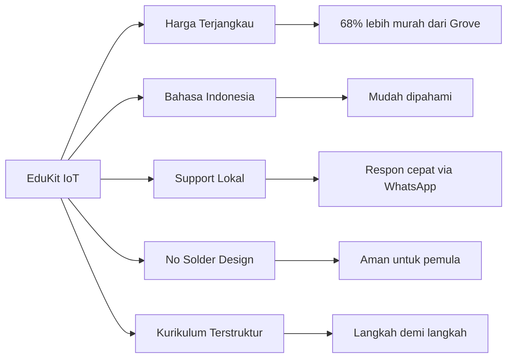
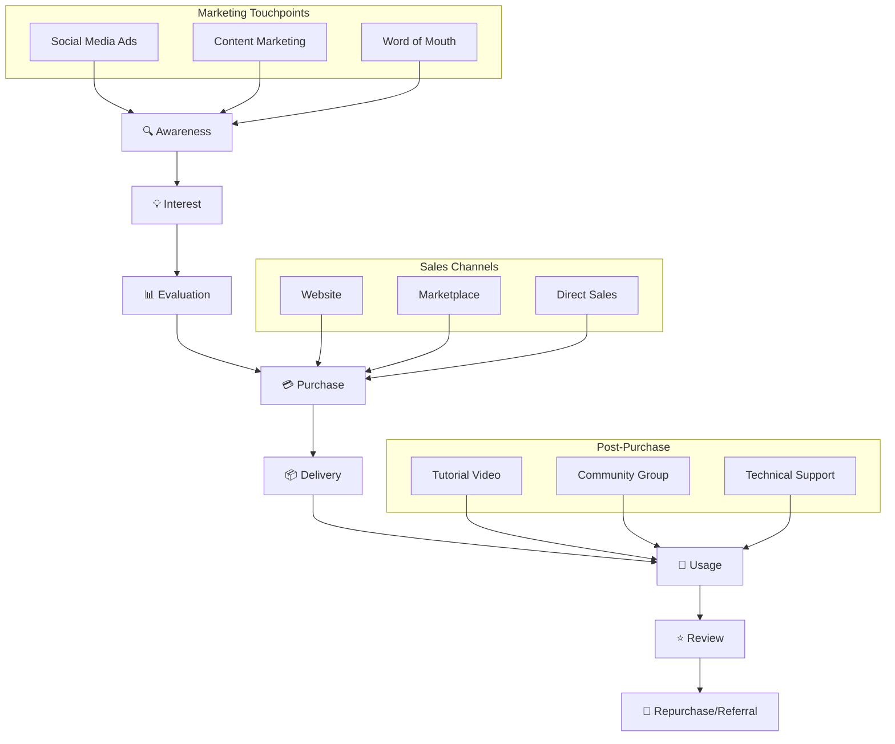
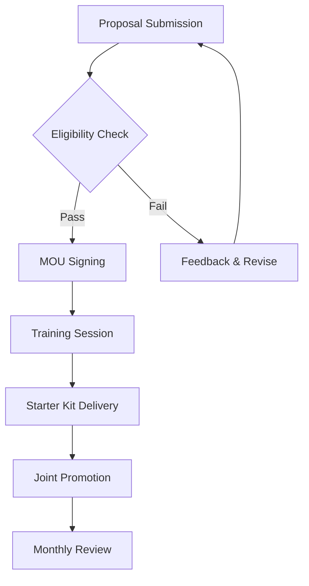

# 📈 01-RENCANA-PEMASARAN

---

## 1.1 TUJUAN PEMASARAN

| **Tujuan** | **Deskripsi** | **Target** |
|------------|---------------|------------|
| Brand Awareness | Memperkenalkan EduKit IoT ke pasar pendidikan | 80% awareness di kalangan mahasiswa teknik |
| Market Share | Menguasai pasar edukasiiot lokal | 15% market share tahun pertama |
| Customer Loyalty | Membangun komunitas pengguna setia | 500+ anggota komunitas aktif |
| Revenue Target | Mencapai target penjualan tahunan | 600 unit Tahun 1 |

---

## 1.2 ANALISIS PASAR SASARAN

### Segmen Pasar

| **Segmen** | **Karakteristik** | **Ukuran** | **Potensi** |
|------------|-------------------|------------|-------------|
| Mahasiswa Teknik | Usia 18-24, aktif praktikum | 50.000/thn | Tinggi |
| Siswa SMK | Jurusan TKJ/Teknik Elektro | 30.000/thn | Sedang-Tinggi |
| Hobbyist/DIY | Maker, electronics enthusiast | 20.000 | Sedang |
| Institusi Pendidikan | Lab kampus, sekolah | 500 institusi | Tinggi |

### Target Market Utama

```
┌─────────────────────────────────────────────────────────────┐
│                    TARGET MARKET PYRAMID                    │
├─────────────────────────────────────────────────────────────┤
│                                                             │
│              /\                                               │
│             /  \  Institusi Pendidikan (B2B)                │
│            /____\  - Lab Kampus                              │
│           /      \ - Sekolah SMK                             │
│          /________\                                          │
│         /          \                                         │
│        /            \  Mahasiswa & Siswa (B2C)              │
│       /______________\ - Praktikum                           │
│      /                \- Tugas Akhir                         │
│     /__________________\                                     │
│    /                  \                                      │
│   /____________________\ Hobbyist & Maker                    │
│                                                               │
└─────────────────────────────────────────────────────────────┘
```

---

## 1.3 ANALISIS KOMPETITOR

### Tabel Perbandingan Kompetitor

| **Fitur** | **EduKit IoT** | **Grove Starter Kit** | **SunFounder** | **AliExpress Generic** |
|-----------|----------------|----------------------|----------------|------------------------|
| **Harga** | Rp 275.000 | Rp 850.000 | Rp 650.000 | Rp 150.000 |
| **Sistem Koneksi** | Jumper (no solder) | Connector Grove | Connector khusus | Breadboard |
| **Kompatibilitas** | ESP32/Arduino | Arduino | Raspberry Pi | Beragam |
| **Bahasa Panduan** | Indonesia | Inggris | Inggris | Cina/Inggris |
| **Garansi** | 1 tahun | 6 bulan | 6 bulan | Tidak ada |
| **Support Lokal** | ✅ Full | ❌ Importir | ❌ Importir | ❌ None |
| **Modul Pembelajaran** | ✅ Terstruktur | ⚠️ Terbatas | ⚠️ Terbatas | ❌ None |
| **Lead Time** | Ready stock | 7-14 hari | 7-14 hari | 14-30 hari |

### Keunggulan Kompetitif EduKit IoT



---

## 1.4 STRATEGI PEMASARAN (MARKETING MIX 4P)

### Product (Produk)

| **Aspek** | **Detail** |
|-----------|------------|
| Nama Produk | EduKit IoT v1.0 |
| Varian | Basic, Advanced, Pro Bundle |
| Fitur Utama | ESP32, 10 sensor, jumper system |
| Packaging | Box premium dengan foam insert |
| Aksesoris | Kabel USB, jumper wire, panduan |

### Price (Harga)

| **Varian** | **Harga Jual** | **HPP** | **Margin** | **Target Customer** |
|------------|----------------|---------|------------|---------------------|
| Basic | Rp 275.000 | Rp 185.000 | 32.7% | Mahasiswa/Siswa |
| Advanced | Rp 425.000 | Rp 290.000 | 31.8% | Hobbyist/Maker |
| Pro Bundle | Rp 650.000 | Rp 450.000 | 30.8% | Institusi/Lab |

### Place (Distribusi)

| **Channel** | **Coverage** | **Biaya** | **Estimasi Penjualan** |
|-------------|--------------|-----------|------------------------|
| Website Official | Nasional | 5% dari penjualan | 40% total |
| Marketplace (Tokopedia/Shopee) | Nasional | 8-10% komisi | 35% total |
| Reseller/Kampus | Regional | 15% margin reseller | 15% total |
| Direct Sales (Institusi) | Jabodetabek | 5% sales cost | 10% total |

### Promotion (Promosi)

| **Media** | **Frekuensi** | **Budget/Bulan** | **Reach Estimasi** |
|-----------|---------------|------------------|---------------------|
| Instagram Ads | Daily | Rp 1.500.000 | 50.000 impressions |
| Facebook Ads | 3x/minggu | Rp 1.000.000 | 30.000 impressions |
| YouTube Tutorial | 2x/bulan | Rp 500.000 | 10.000 views |
| Influencer Tech | 1x/bulan | Rp 1.000.000 | 20.000 reach |
| Campus Event | 2x/bulan | Rp 1.500.000 | 500 direct contact |
| **Total** | | **Rp 5.500.000** | **110.500+ reach** |

---

## 1.5 CUSTOMER JOURNEY



---

## 1.6 SALES FUNNEL

```mermaid
funnel
    title Sales Funnel EduKit IoT
    "Awareness (100.000 reach)" : 100000
    "Interest (5% CTR)" : 5000
    "Consideration (20% engage)" : 1000
    "Intent (30% add to cart)" : 300
    "Purchase (60% convert)" : 180
    "Retention (40% repeat)" : 72
```

---

## 1.7 RAMALAN PENJUALAN 5 TAHUN

### Proyeksi Volume Penjualan

| **Tahun** | **Unit Terjual** | **Growth %** | **Harga/Unit** | **Total Revenue** |
|-----------|------------------|--------------|----------------|-------------------|
| Tahun 1 | 600 | - | Rp 275.000 | Rp 165.000.000 |
| Tahun 2 | 900 | 50% | Rp 275.000 | Rp 247.500.000 |
| Tahun 3 | 1.350 | 50% | Rp 275.000 | Rp 371.250.000 |
| Tahun 4 | 1.755 | 30% | Rp 275.000 | Rp 482.625.000 |
| Tahun 5 | 2.282 | 30% | Rp 275.000 | Rp 627.550.000 |

### ASCII Bar Chart - Penjualan per Tahun

```
Penjualan Unit (5 Tahun)
━━━━━━━━━━━━━━━━━━━━━━━━━━━━━━━━━━━━━━━━━━━━━━━━━━━━━━━━━━━━━

Tahun 1  [████████░░░░░░░░░░░░░░░░░░░░] 600 unit   Rp 165.000.000
Tahun 2  [████████████░░░░░░░░░░░░░░░░] 900 unit   Rp 247.500.000
Tahun 3  [█████████████████░░░░░░░░░░░] 1.350 unit Rp 371.250.000
Tahun 4  [██████████████████████░░░░░░] 1.755 unit Rp 482.625.000
Tahun 5  [████████████████████████████] 2.282 unit Rp 627.550.000

         └────────────────────────────────────────────────────
         0        500       1000      1500      2000      2500
```

### Breakdown Penjualan per Channel (Tahun 1)

| **Channel** | **%** | **Unit** | **Revenue** |
|-------------|-------|----------|-------------|
| Website Official | 40% | 240 | Rp 66.000.000 |
| Marketplace | 35% | 210 | Rp 57.750.000 |
| Reseller/Kampus | 15% | 90 | Rp 24.750.000 |
| Direct Sales | 10% | 60 | Rp 16.500.000 |
| **Total** | **100%** | **600** | **Rp 165.000.000** |

---

## 1.8 STRATEGI HARGA

### Pricing Strategy

```
┌─────────────────────────────────────────────────────────────┐
│                    PRICE WATERFALL                          │
├─────────────────────────────────────────────────────────────┤
│  Harga List              : Rp 275.000                       │
│  (-) Diskon Early Bird   : Rp  25.000 (9.1%)               │
│  (-) Bundle Discount     : Rp  15.000 (5.5%)               │
│  (-) Promo Marketplace   : Rp  10.000 (3.6%)               │
├─────────────────────────────────────────────────────────────┤
│  Net Price Average       : Rp 225.000                       │
│  HPP                     : Rp 185.000                       │
├─────────────────────────────────────────────────────────────┤
│  Net Margin              : Rp  40.000 (21.6%)              │
└─────────────────────────────────────────────────────────────┘
```

### Strategi Diskon

| **Jenis Diskon** | **Besaran** | **Kondisi** | **Target** |
|------------------|-------------|-------------|------------|
| Early Bird | 10% | Pre-order batch 1 | Cash flow awal |
| Bundle 2 pcs | 15% | Pembelian 2 unit | Volume boost |
| Campus Partner | 20% | Minimal 10 unit | B2B acquisition |
| Loyalty Program | 5% | Repeat customer | Retention |

---

## 1.9 ANGGARAN PROMOSI

### Rincian Budget Promosi Tahun 1

| **Item** | **Budget/Bulan** | **Budget/Tahun** | **KPI** |
|----------|------------------|------------------|---------|
| Digital Ads (IG/FB) | Rp 2.500.000 | Rp 30.000.000 | CPC < Rp 500 |
| Content Production | Rp 1.000.000 | Rp 12.000.000 | 24 video/tahun |
| Influencer Collaboration | Rp 1.000.000 | Rp 12.000.000 | 12 collab/tahun |
| Event & Exhibition | Rp 2.000.000 | Rp 24.000.000 | 20 event/tahun |
| Printed Materials | Rp 500.000 | Rp 6.000.000 | 5000 brosur |
| Samples/Review Units | Rp 1.000.000 | Rp 12.000.000 | 50 units given |
| **TOTAL** | **Rp 8.000.000** | **Rp 96.000.000** | |

### ROI Promosi

| **Metric** | **Target** | **Formula** |
|------------|------------|-------------|
| CAC (Customer Acquisition Cost) | < Rp 160.000 | Total Marketing Cost / New Customers |
| ROMI (Return on Marketing Investment) | > 200% | (Revenue from Marketing - Cost) / Cost × 100% |
| Conversion Rate | > 3% | Purchases / Website Visitors × 100% |

---

## 1.10 KEBIJAKAN DISTRIBUTOR & RESELLER

### Struktur Reseller

| **Level** | **Discount** | **Min Order** | **Benefit** |
|-----------|--------------|---------------|-------------|
| Silver | 10% | 5 unit | Priority support |
| Gold | 15% | 20 unit | Marketing material + co-branding |
| Platinum | 20% | 50 unit | Exclusive territory + training |

### Syarat Partnership Kampus



---

## 1.11 METRIK KINERJA PEMASARAN

### KPI Dashboard

| **KPI** | **Target Bulan 1** | **Target Bulan 6** | **Target Bulan 12** |
|---------|--------------------|--------------------|---------------------|
| Website Traffic | 1.000 visits | 5.000 visits | 15.000 visits |
| Social Media Followers | 500 | 3.000 | 10.000 |
| Email Subscribers | 100 | 1.000 | 5.000 |
| Conversion Rate | 1.5% | 2.5% | 3.5% |
| Customer Satisfaction | 4.0/5 | 4.3/5 | 4.5/5 |
| Repeat Purchase Rate | 5% | 15% | 25% |

---

## 1.12 STRATEGI RETENSI PELANGGAN

### Customer Retention Program

```
┌─────────────────────────────────────────────────────────────┐
│                 CUSTOMER LIFECYCLE PROGRAM                  │
├─────────────────────────────────────────────────────────────┤
│                                                             │
│  🎯 Onboarding → 📚 Learning → 👥 Community → 🏆 Rewards   │
│                                                             │
│  • Welcome Email     • Tutorial Access   • Forum Access    │
│  • Setup Guide       • Project Ideas     • Badge System    │
│  • Video Series      • Challenge Monthly • Discount Points │
│  • FAQ Database      • Showcase Gallery  • Referral Bonus  │
│                                                             │
└─────────────────────────────────────────────────────────────┘
```

### Program Loyalitas

| **Tier** | **Syarat** | **Benefit** |
|----------|------------|-------------|
| Bronze | 1 pembelian | Akses community, newsletter |
| Silver | 3 pembelian | 5% discount, early access |
| Gold | 5 pembelian | 10% discount, free shipping, priority support |
| Platinum | 10 pembelian | 15% discount, exclusive products, ambassador program |

---

*© 2025 EduKit IoT - Rencana Pemasaran*
