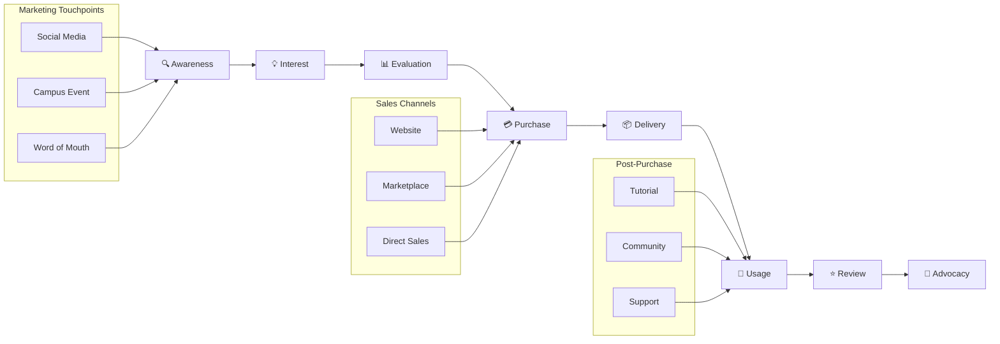

# 📈 01-RENCANA-PEMASARAN

---

## 1.1 GAMBARAN PASAR

### Deskripsi Pasar EduKit IoT

Pasar perangkat edukasi embedded system dan IoT di Indonesia menunjukkan pertumbuhan yang signifikan seiring dengan meningkatnya demand terhadap keterampilan teknologi di bidang Internet of Things, robotika, dan sistem tertanam.

| **Indikator** | **Deskripsi** |
|---------------|---------------|
| Ukuran Pasar | 100.000+ mahasiswa teknik di Indonesia |
| Pertumbuhan | 15-20% per tahun |
| Trend | Meningkatnya adopsi IoT di pendidikan |
| Peluang | Kebutuhan alat praktikum terjangkau |

---

## 1.2 SEGMENTASI PASAR

### Tabel Segmentasi

| **Segmen** | **Karakteristik** | **Ukuran** | **Potensi** |
|------------|-------------------|------------|-------------|
| Mahasiswa Teknik | Usia 18-24, aktif praktikum, D3/S1 | 50.000/thn | Tinggi |
| Siswa SMK | Jurusan TKJ/Teknik Elektro | 30.000/thn | Sedang-Tinggi |
| Hobbyist/DIY | Maker, electronics enthusiast | 20.000 | Sedang |
| Institusi Pendidikan | Lab kampus, sekolah vokasi | 500 institusi | Tinggi |

---

## 1.3 TARGET PASAR

### Target Utama Tahun 1 (Model Realistis)

| **Segment** | **Target Unit** | **Persentase** | **Revenue Target** |
|-------------|-----------------|----------------|-------------------|
| Mahasiswa Teknik | 150 unit | 50% | Rp 41.250.000 |
| Siswa SMK | 75 unit | 25% | Rp 20.625.000 |
| Hobbyist/DIY | 45 unit | 15% | Rp 12.375.000 |
| Institusi Pendidikan | 30 unit | 10% | Rp 8.250.000 |
| **Total** | **300 unit** | **100%** | **Rp 82.500.000** |

---

## 1.4 POSITIONING

### Positioning Statement

```
┌─────────────────────────────────────────────────────────────┐
│                    POSITIONING MAP                          │
├─────────────────────────────────────────────────────────────┤
│                                                             │
│  Harga Tinggi                                               │
│       │                                                     │
│       │   ● Grove           ● SunFounder                   │
│       │     (Import)          (Import)                     │
│       │                                                     │
│       │                                                     │
│       │                        ● Keyestudio                │
│       │                                                     │
│       │                                    ● EduKit IoT    │
│       │                                      (Local)       │
│       │                                                     │
│       │   ● AliExpress Generic                             │
│       │     (No Support)                                   │
│       └─────────────────────────────────────────────────────│
│       Rendah              Kualitas              Tinggi      │
│                                                             │
└─────────────────────────────────────────────────────────────┘
```

**Positioning EduKit IoT:** "Platform pembelajaran modular berkualitas tinggi dengan harga terjangkau dan dukungan lokal penuh."

---

## 1.5 ANALISIS KOMPETITOR

### Tabel Perbandingan Kompetitor

| **Fitur** | **EduKit IoT** | **Grove (Seeed)** | **DFRobot** | **SunFounder** | **Keyestudio** |
|-----------|----------------|-------------------|-------------|----------------|----------------|
| **Harga** | Rp 275.000 | Rp 850.000+ | Rp 750.000+ | Rp 650.000+ | Rp 550.000+ |
| **Sistem Koneksi** | Jumper (no solder) | Connector Grove | Connector khusus | Connector khusus | Breadboard |
| **Kompatibilitas** | ESP32/Arduino | Arduino | Arduino | Raspberry Pi | Arduino |
| **Dokumentasi** | Bilingual (ID/EN) | Inggris | Inggris | Inggris | Inggris/Cina |
| **Support Lokal** | ✅ Full (WhatsApp) | ❌ Importir | ❌ Importir | ❌ Importir | ❌ Importir |
| **Garansi** | 1 tahun | 6 bulan | 6 bulan | 6 bulan | 3 bulan |
| **Lead Time** | Ready stock | 7-14 hari | 7-14 hari | 7-14 hari | 14-30 hari |
| **Modul Pembelajaran** | ✅ Terstruktur | ⚠️ Terbatas | ⚠️ Terbatas | ⚠️ Terbatas | ❌ None |
| **Keunggulan EduKit** | Harga 68% lebih murah, support lokal, dokumentasi bilingual | Brand global, ekosistem luas | Variasi produk banyak | Lengkap dengan display | Harga kompetitif |

### Customer Journey



---

## 1.6 STRATEGI PRODUK

### Product Strategy

| **Aspek** | **Detail** |
|-----------|------------|
| Nama Produk | EduKit IoT v1.0 |
| Varian | Basic Kit, Advanced Kit, Pro Bundle |
| Fitur Utama | ESP32, 10 sensor, jumper system, case |
| Packaging | Box premium dengan foam insert |
| Aksesoris | Kabel USB, jumper wire, panduan bilingual |
| Dokumentasi | User manual, tutorial video, GitHub repository |

---

## 1.7 STRATEGI HARGA

### Pricing Structure

| **Varian** | **Harga Jual** | **HPP** | **Margin** | **Target Customer** |
|------------|----------------|---------|------------|---------------------|
| Basic Kit | Rp 275.000 | Rp 185.000 | 32.7% | Mahasiswa/Siswa |
| Advanced Kit | Rp 425.000 | Rp 290.000 | 31.8% | Hobbyist/Maker |
| Pro Bundle | Rp 650.000 | Rp 450.000 | 30.8% | Institusi/Lab |

### Strategi Penetapan Harga

```
┌─────────────────────────────────────────────────────────────┐
│                    PRICE STRUCTURE                          │
├─────────────────────────────────────────────────────────────┤
│  Harga List              : Rp 275.000                       │
│  (-) Diskon Early Bird   : Rp  25.000 (9.1%)               │
│  (-) Bundle Discount     : Rp  15.000 (5.5%)               │
│  (-) Promo Marketplace   : Rp  10.000 (3.6%)               │
├─────────────────────────────────────────────────────────────┤
│  Net Price Average       : Rp 225.000                       │
│  HPP                     : Rp 185.000                       │
├─────────────────────────────────────────────────────────────┤
│  Net Margin              : Rp  40.000 (21.6%)              │
└─────────────────────────────────────────────────────────────┘
```

---

## 1.8 STRATEGI DISTRIBUSI

### Distribution Channels

| **Channel** | **Coverage** | **Biaya** | **Estimasi Penjualan** |
|-------------|--------------|-----------|------------------------|
| Website Official | Nasional | 5% dari penjualan | 40% total |
| Marketplace (Tokopedia/Shopee) | Nasional | 8-10% komisi | 35% total |
| Reseller/Kampus | Regional | 15% margin reseller | 15% total |
| Direct Sales (Institusi) | Malang & Jatim | 5% sales cost | 10% total |

---

## 1.9 STRATEGI PROMOSI

### Promotion Mix (Model Realistis)

| **Media** | **Frekuensi** | **Budget/Bulan** | **Reach Estimasi** |
|-----------|---------------|------------------|---------------------|
| Instagram Ads | 5x/minggu | Rp 600.000 | 25.000 impressions |
| Facebook Ads | 2x/minggu | Rp 400.000 | 15.000 impressions |
| YouTube Tutorial | 1x/bulan | Rp 300.000 | 5.000 views |
| Influencer Tech | 1x/quarter | Rp 250.000 | 5.000 reach |
| Campus Event | 1x/bulan | Rp 1.000.000 | 250 direct contact |
| **Total** | | **Rp 2.550.000** | **50.000+ reach** |

**Catatan:** Budget promosi harian disesuaikan dengan model lean startup. Fokus pada organic content dan word-of-mouth marketing untuk efisiensi biaya.

---

## 1.10 SALES FUNNEL

### Sales Funnel Projection (Tahun 1)

Berikut adalah proyeksi sales funnel untuk mencapai target **300 unit** di Tahun 1:

| **Stage** | **Deskripsi** | **Conversion Rate** | **Volume** |
|-----------|---------------|---------------------|------------|
| **Awareness** | Reach melalui social media, campus event, word of mouth | - | 50.000 orang |
| **Interest** | Klik link, visit website/marketplace | 5% CTR | 2.500 orang |
| **Consideration** | Lihat produk, baca detail, bandingkan | 20% engage | 500 orang |
| **Intent** | Add to cart, tanya via WA | 40% intent | 200 orang |
| **Purchase** | Checkout dan bayar | 75% convert | **150 orang** |
| **Retention** | Repeat order/referal (tahun berikutnya) | 30% repeat | 45 orang |

**Catatan:** 
- Dengan funnel di atas, dibutuhkan reach ~50.000 orang untuk konversi 150 pembeli per tahun
- Target 300 unit dicapai melalui kombinasi: 150 unit direct + 100 unit institusi + 50 unit reseller
- Conversion rate akan dioptimalkan melalui improvement di setiap stage

### Visualisasi Funnel (ASCII)

```
Sales Funnel EduKit IoT - Target Tahun 1
━━━━━━━━━━━━━━━━━━━━━━━━━━━━━━━━━━━━━━━━━━━━━━━━━━━━━━━━━━━━━

Awareness      [████████████████████████████████████████] 50.000 reach
               │ 5% CTR
               ▼
Interest       [████████░░░░░░░░░░░░░░░░░░░░░░░░░░░░░░░░] 2.500 visitors
               │ 20% engage
               ▼
Consideration  [███░░░░░░░░░░░░░░░░░░░░░░░░░░░░░░░░░░░░░] 500 prospects
               │ 40% intent
               ▼
Intent         [█░░░░░░░░░░░░░░░░░░░░░░░░░░░░░░░░░░░░░░░] 200 hot leads
               │ 75% convert
               ▼
Purchase       [█░░░░░░░░░░░░░░░░░░░░░░░░░░░░░░░░░░░░░░░] 150 customers
               │ 30% repeat
               ▼
Retention      [░░░░░░░░░░░░░░░░░░░░░░░░░░░░░░░░░░░░░░░░] 45 repeat buyers

Target Total: 300 unit/tahun (termasuk channel institusi & reseller)
```

---

## 1.11 RAMALAN PENJUALAN 5 TAHUN

### Proyeksi Volume Penjualan (Model Realistis)

| **Tahun** | **Unit Terjual** | **Growth %** | **Harga/Unit** | **Total Revenue** |
|-----------|------------------|--------------|----------------|-------------------|
| Tahun 1 | 300 | - | Rp 275.000 | Rp 82.500.000 |
| Tahun 2 | 500 | 67% | Rp 275.000 | Rp 137.500.000 |
| Tahun 3 | 800 | 60% | Rp 275.000 | Rp 220.000.000 |
| Tahun 4 | 1.200 | 50% | Rp 275.000 | Rp 330.000.000 |
| Tahun 5 | 1.750 | 46% | Rp 275.000 | Rp 481.250.000 |

### ASCII Bar Chart - Penjualan per Tahun

```
Penjualan Unit (5 Tahun) - Model Realistis
━━━━━━━━━━━━━━━━━━━━━━━━━━━━━━━━━━━━━━━━━━━━━━━━━━━━━━━━━━━━━

Tahun 1  [█████░░░░░░░░░░░░░░░░░░░░░] 300 unit   Rp 82,5jt
Tahun 2  [████████░░░░░░░░░░░░░░░░░░] 500 unit   Rp 137,5jt
Tahun 3  [█████████████░░░░░░░░░░░░░] 800 unit   Rp 220jt
Tahun 4  [███████████████████░░░░░░░] 1.200 unit Rp 330jt
Tahun 5  [█████████████████████████░] 1.750 unit Rp 481jt

         └────────────────────────────────────────────────────
         0       500      1000      1500      2000
```

### Breakdown Penjualan per Channel (Tahun 1)

| **Channel** | **%** | **Unit** | **Revenue** |
|-------------|-------|----------|-------------|
| Website Official | 40% | 120 | Rp 33.000.000 |
| Marketplace | 35% | 105 | Rp 28.875.000 |
| Reseller/Kampus | 15% | 45 | Rp 12.375.000 |
| Direct Sales (Institusi) | 10% | 30 | Rp 8.250.000 |
| **Total** | **100%** | **300** | **Rp 82.500.000** |

---

## 1.12 ANGGARAN PROMOSI

### Rincian Budget Promosi Tahun 1 (Model Realistis)

| **Item** | **Budget/Bulan** | **Budget/Tahun** | **KPI** |
|----------|------------------|------------------|---------|
| Digital Ads (IG/FB) | Rp 1.000.000 | Rp 12.000.000 | CPC < Rp 500 |
| Content Production | Rp 500.000 | Rp 6.000.000 | 12 video/tahun |
| Influencer Collaboration | Rp 300.000 | Rp 3.600.000 | 4 collab/tahun |
| Event & Exhibition | Rp 1.000.000 | Rp 12.000.000 | 10 event/tahun |
| Printed Materials | Rp 250.000 | Rp 3.000.000 | 2500 brosur |
| Samples/Review Units | Rp 500.000 | Rp 6.000.000 | 20 units given |
| **TOTAL** | **Rp 3.550.000** | **Rp 42.600.000** | |

**Catatan:** Budget promosi disesuaikan dengan model lean startup (51% lebih hemat dari model ideal). Fokus pada organic growth dan campus event yang cost-effective.

### ROI Promosi

| **Metric** | **Target** | **Formula** |
|------------|------------|-------------|
| CAC (Customer Acquisition Cost) | < Rp 142.000 | Total Marketing Cost / New Customers |
| ROMI (Return on Marketing Investment) | > 150% | (Revenue from Marketing - Cost) / Cost × 100% |
| Conversion Rate | > 3% | Purchases / Website Visitors × 100% |

---

*© 2025 EduKit IoT - M Faris Asroru Ghifary - Rencana Pemasaran*
