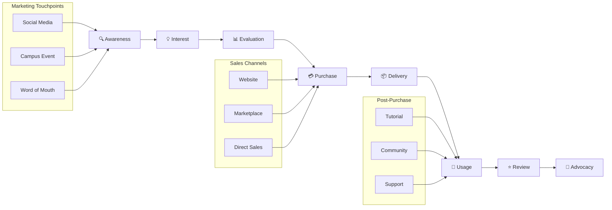

# 📈 01-RENCANA-PEMASARAN

---

## 1.1 GAMBARAN PASAR

### Deskripsi Pasar EduKit IoT

Pasar perangkat edukasi embedded system dan IoT di Indonesia menunjukkan pertumbuhan yang signifikan seiring dengan meningkatnya demand terhadap keterampilan teknologi di bidang Internet of Things, robotika, dan sistem tertanam.

| **Indikator** | **Deskripsi** |
|---------------|---------------|
| Ukuran Pasar | 100.000+ mahasiswa teknik di Indonesia |
| Pertumbuhan | 15-20% per tahun |
| Trend | Meningkatnya adopsi IoT di pendidikan |
| Peluang | Kebutuhan alat praktikum terjangkau |

---

## 1.2 SEGMENTASI PASAR

### Tabel Segmentasi

| **Segmen** | **Karakteristik** | **Ukuran** | **Potensi** |
|------------|-------------------|------------|-------------|
| Mahasiswa Teknik | Usia 18-24, aktif praktikum, D3/S1 | 50.000/thn | Tinggi |
| Siswa SMK | Jurusan TKJ/Teknik Elektro | 30.000/thn | Sedang-Tinggi |
| Hobbyist/DIY | Maker, electronics enthusiast | 20.000 | Sedang |
| Institusi Pendidikan | Lab kampus, sekolah vokasi | 500 institusi | Tinggi |

---

## 1.3 TARGET PASAR

### Target Utama Tahun 1

| **Segment** | **Target Unit** | **Persentase** | **Revenue Target** |
|-------------|-----------------|----------------|-------------------|
| Mahasiswa Teknik | 300 unit | 50% | Rp 82.500.000 |
| Siswa SMK | 150 unit | 25% | Rp 41.250.000 |
| Hobbyist/DIY | 90 unit | 15% | Rp 24.750.000 |
| Institusi Pendidikan | 60 unit | 10% | Rp 16.500.000 |
| **Total** | **600 unit** | **100%** | **Rp 165.000.000** |

---

## 1.4 POSITIONING

### Positioning Statement

```
┌─────────────────────────────────────────────────────────────┐
│                    POSITIONING MAP                          │
├─────────────────────────────────────────────────────────────┤
│                                                             │
│  Harga Tinggi                                               │
│       │                                                     │
│       │   ● Grove           ● SunFounder                   │
│       │     (Import)          (Import)                     │
│       │                                                     │
│       │                                                     │
│       │                        ● Keyestudio                │
│       │                                                     │
│       │                                    ● EduKit IoT    │
│       │                                      (Local)       │
│       │                                                     │
│       │   ● AliExpress Generic                             │
│       │     (No Support)                                   │
│       └─────────────────────────────────────────────────────│
│       Rendah              Kualitas              Tinggi      │
│                                                             │
└─────────────────────────────────────────────────────────────┘
```

**Positioning EduKit IoT:** "Platform pembelajaran modular berkualitas tinggi dengan harga terjangkau dan dukungan lokal penuh."

---

## 1.5 ANALISIS KOMPETITOR

### Tabel Perbandingan Kompetitor

| **Fitur** | **EduKit IoT** | **Grove (Seeed)** | **DFRobot** | **SunFounder** | **Keyestudio** |
|-----------|----------------|-------------------|-------------|----------------|----------------|
| **Harga** | Rp 275.000 | Rp 850.000+ | Rp 750.000+ | Rp 650.000+ | Rp 550.000+ |
| **Sistem Koneksi** | Jumper (no solder) | Connector Grove | Connector khusus | Connector khusus | Breadboard |
| **Kompatibilitas** | ESP32/Arduino | Arduino | Arduino | Raspberry Pi | Arduino |
| **Dokumentasi** | Bilingual (ID/EN) | Inggris | Inggris | Inggris | Inggris/Cina |
| **Support Lokal** | ✅ Full (WhatsApp) | ❌ Importir | ❌ Importir | ❌ Importir | ❌ Importir |
| **Garansi** | 1 tahun | 6 bulan | 6 bulan | 6 bulan | 3 bulan |
| **Lead Time** | Ready stock | 7-14 hari | 7-14 hari | 7-14 hari | 14-30 hari |
| **Modul Pembelajaran** | ✅ Terstruktur | ⚠️ Terbatas | ⚠️ Terbatas | ⚠️ Terbatas | ❌ None |
| **Keunggulan EduKit** | Harga 68% lebih murah, support lokal, dokumentasi bilingual | Brand global, ekosistem luas | Variasi produk banyak | Lengkap dengan display | Harga kompetitif |

### Customer Journey



---

## 1.6 STRATEGI PRODUK

### Product Strategy

| **Aspek** | **Detail** |
|-----------|------------|
| Nama Produk | EduKit IoT v1.0 |
| Varian | Basic Kit, Advanced Kit, Pro Bundle |
| Fitur Utama | ESP32, 10 sensor, jumper system, case |
| Packaging | Box premium dengan foam insert |
| Aksesoris | Kabel USB, jumper wire, panduan bilingual |
| Dokumentasi | User manual, tutorial video, GitHub repository |

---

## 1.7 STRATEGI HARGA

### Pricing Structure

| **Varian** | **Harga Jual** | **HPP** | **Margin** | **Target Customer** |
|------------|----------------|---------|------------|---------------------|
| Basic Kit | Rp 275.000 | Rp 185.000 | 32.7% | Mahasiswa/Siswa |
| Advanced Kit | Rp 425.000 | Rp 290.000 | 31.8% | Hobbyist/Maker |
| Pro Bundle | Rp 650.000 | Rp 450.000 | 30.8% | Institusi/Lab |

### Strategi Penetapan Harga

```
┌─────────────────────────────────────────────────────────────┐
│                    PRICE STRUCTURE                          │
├─────────────────────────────────────────────────────────────┤
│  Harga List              : Rp 275.000                       │
│  (-) Diskon Early Bird   : Rp  25.000 (9.1%)               │
│  (-) Bundle Discount     : Rp  15.000 (5.5%)               │
│  (-) Promo Marketplace   : Rp  10.000 (3.6%)               │
├─────────────────────────────────────────────────────────────┤
│  Net Price Average       : Rp 225.000                       │
│  HPP                     : Rp 185.000                       │
├─────────────────────────────────────────────────────────────┤
│  Net Margin              : Rp  40.000 (21.6%)              │
└─────────────────────────────────────────────────────────────┘
```

---

## 1.8 STRATEGI DISTRIBUSI

### Distribution Channels

| **Channel** | **Coverage** | **Biaya** | **Estimasi Penjualan** |
|-------------|--------------|-----------|------------------------|
| Website Official | Nasional | 5% dari penjualan | 40% total |
| Marketplace (Tokopedia/Shopee) | Nasional | 8-10% komisi | 35% total |
| Reseller/Kampus | Regional | 15% margin reseller | 15% total |
| Direct Sales (Institusi) | Malang & Jatim | 5% sales cost | 10% total |

---

## 1.9 STRATEGI PROMOSI

### Promotion Mix

| **Media** | **Frekuensi** | **Budget/Bulan** | **Reach Estimasi** |
|-----------|---------------|------------------|---------------------|
| Instagram Ads | Daily | Rp 1.500.000 | 50.000 impressions |
| Facebook Ads | 3x/minggu | Rp 1.000.000 | 30.000 impressions |
| YouTube Tutorial | 2x/bulan | Rp 500.000 | 10.000 views |
| Influencer Tech | 1x/bulan | Rp 1.000.000 | 20.000 reach |
| Campus Event | 2x/bulan | Rp 1.500.000 | 500 direct contact |
| **Total** | | **Rp 5.500.000** | **110.500+ reach** |

---

## 1.10 SALES FUNNEL

```mermaid
funnel
    title Sales Funnel EduKit IoT
    "Awareness (100.000 reach)" : 100000
    "Interest (5% CTR)" : 5000
    "Consideration (20% engage)" : 1000
    "Intent (30% add to cart)" : 300
    "Purchase (60% convert)" : 180
    "Retention (40% repeat)" : 72
```

---

## 1.11 RAMALAN PENJUALAN 5 TAHUN

### Proyeksi Volume Penjualan

| **Tahun** | **Unit Terjual** | **Growth %** | **Harga/Unit** | **Total Revenue** |
|-----------|------------------|--------------|----------------|-------------------|
| Tahun 1 | 600 | - | Rp 275.000 | Rp 165.000.000 |
| Tahun 2 | 900 | 50% | Rp 275.000 | Rp 247.500.000 |
| Tahun 3 | 1.350 | 50% | Rp 275.000 | Rp 371.250.000 |
| Tahun 4 | 1.755 | 30% | Rp 275.000 | Rp 482.625.000 |
| Tahun 5 | 2.282 | 30% | Rp 275.000 | Rp 627.550.000 |

### ASCII Bar Chart - Penjualan per Tahun

```
Penjualan Unit (5 Tahun)
━━━━━━━━━━━━━━━━━━━━━━━━━━━━━━━━━━━━━━━━━━━━━━━━━━━━━━━━━━━━━

Tahun 1  [████████░░░░░░░░░░░░░░░░░░░░] 600 unit   Rp 165.000.000
Tahun 2  [████████████░░░░░░░░░░░░░░░░] 900 unit   Rp 247.500.000
Tahun 3  [█████████████████░░░░░░░░░░░] 1.350 unit Rp 371.250.000
Tahun 4  [██████████████████████░░░░░░] 1.755 unit Rp 482.625.000
Tahun 5  [████████████████████████████] 2.282 unit Rp 627.550.000

         └────────────────────────────────────────────────────
         0        500       1000      1500      2000      2500
```

### Breakdown Penjualan per Channel (Tahun 1)

| **Channel** | **%** | **Unit** | **Revenue** |
|-------------|-------|----------|-------------|
| Website Official | 40% | 240 | Rp 66.000.000 |
| Marketplace | 35% | 210 | Rp 57.750.000 |
| Reseller/Kampus | 15% | 90 | Rp 24.750.000 |
| Direct Sales | 10% | 60 | Rp 16.500.000 |
| **Total** | **100%** | **600** | **Rp 165.000.000** |

---

## 1.12 ANGGARAN PROMOSI

### Rincian Budget Promosi Tahun 1

| **Item** | **Budget/Bulan** | **Budget/Tahun** | **KPI** |
|----------|------------------|------------------|---------|
| Digital Ads (IG/FB) | Rp 2.500.000 | Rp 30.000.000 | CPC < Rp 500 |
| Content Production | Rp 1.000.000 | Rp 12.000.000 | 24 video/tahun |
| Influencer Collaboration | Rp 1.000.000 | Rp 12.000.000 | 12 collab/tahun |
| Event & Exhibition | Rp 2.000.000 | Rp 24.000.000 | 20 event/tahun |
| Printed Materials | Rp 500.000 | Rp 6.000.000 | 5000 brosur |
| Samples/Review Units | Rp 1.000.000 | Rp 12.000.000 | 50 units given |
| **TOTAL** | **Rp 8.000.000** | **Rp 96.000.000** | |

### ROI Promosi

| **Metric** | **Target** | **Formula** |
|------------|------------|-------------|
| CAC (Customer Acquisition Cost) | < Rp 160.000 | Total Marketing Cost / New Customers |
| ROMI (Return on Marketing Investment) | > 200% | (Revenue from Marketing - Cost) / Cost × 100% |
| Conversion Rate | > 3% | Purchases / Website Visitors × 100% |

---

*© 2025 EduKit IoT - M Faris Asroru Ghifary - Rencana Pemasaran*
