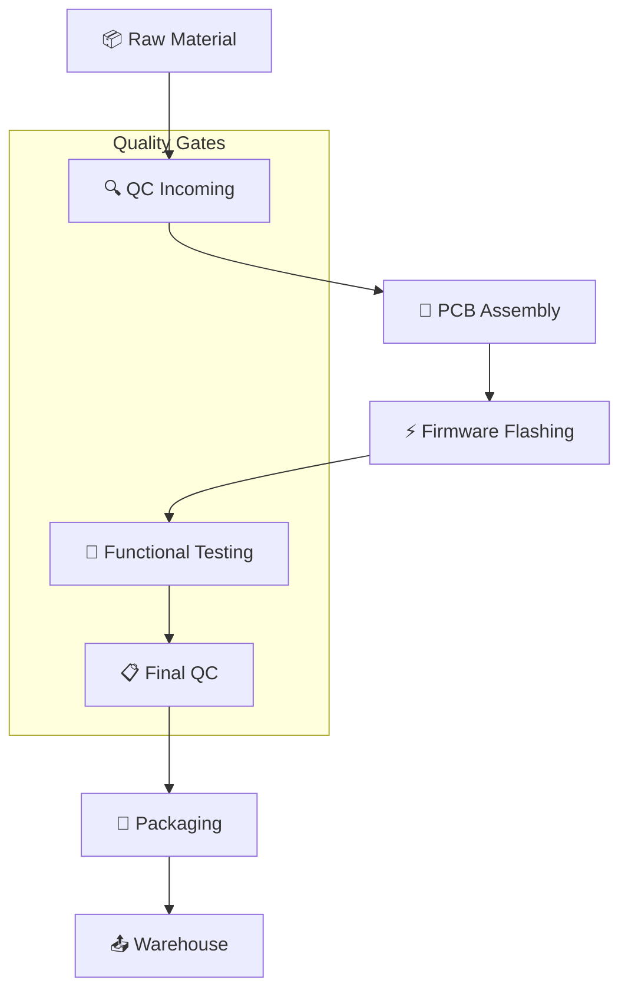
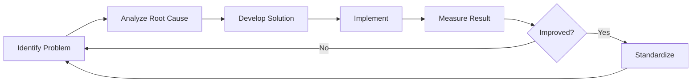

# 🏭 02-RENCANA-PRODUKSI

---

## 2.1 DESKRIPSI PROSES PRODUKSI

EduKit IoT diproduksi melalui proses assembly semi-otomatis dengan kontrol kualitas ketat. Proses produksi dibagi menjadi 5 tahap utama:



---

## 2.2 BILL OF MATERIALS (BOM)

### Komponen Utama per Unit

| **No** | **Komponen** | **Spesifikasi** | **Qty** | **Harga Satuan** | **Total/Unit** | **Supplier** |
|--------|--------------|-----------------|---------|------------------|----------------|--------------|
| 1 | ESP32-WROOM-32D | Dual-core, WiFi+BT | 1 | Rp 45.000 | Rp 45.000 | Import/Taiwan |
| 2 | PCB Custom 2-layer | 10x8cm, HASL finish | 1 | Rp 25.000 | Rp 25.000 | Lokal Jakarta |
| 3 | Sensor DHT11 | Temp & Humidity | 1 | Rp 8.000 | Rp 8.000 | Lokal |
| 4 | Sensor MQ-2 | Smoke/Gas detector | 1 | Rp 12.000 | Rp 12.000 | Lokal |
| 5 | Ultrasonic HC-SR04 | Distance sensor | 1 | Rp 10.000 | Rp 10.000 | Lokal |
| 6 | Relay Module 5V | 1-channel | 1 | Rp 7.000 | Rp 7.000 | Lokal |
| 7 | LED RGB Common Anode | 5mm | 3 | Rp 1.000 | Rp 3.000 | Lokal |
| 8 | Push Button | 12mm tactile | 4 | Rp 500 | Rp 2.000 | Lokal |
| 9 | Potentiometer 10K | Rotary | 1 | Rp 2.000 | Rp 2.000 | Lokal |
| 10 | LDR | Photoresistor | 1 | Rp 1.000 | Rp 1.000 | Lokal |
| 11 | Buzzer Active | 5V | 1 | Rp 2.000 | Rp 2.000 | Lokal |
| 12 | Jumper Wire Set | Female-to-female | 20 | Rp 200 | Rp 4.000 | Lokal |
| 13 | Connector Pin Header | 2.54mm pitch | 40 | Rp 300 | Rp 12.000 | Lokal |
| 14 | USB Cable Micro | 1m | 1 | Rp 8.000 | Rp 8.000 | Lokal |
| 15 | Box Packaging | Custom cardboard | 1 | Rp 15.000 | Rp 15.000 | Lokal |
| 16 | Foam Insert | Protective | 1 | Rp 5.000 | Rp 5.000 | Lokal |
| 17 | User Manual | Full color A5 | 1 | Rp 3.000 | Rp 3.000 | Percetakan |
| 18 | Sticker/Label | Branding | 2 | Rp 500 | Rp 1.000 | Percetakan |
| **TOTAL** | | | | | **Rp 185.000** | |

### Breakdown Biaya Bahan Baku

```
┌─────────────────────────────────────────────────────────────┐
│              BREAKDOWN BIAYA BAHAN BAKTI                    │
├─────────────────────────────────────────────────────────────┤
│                                                             │
│  Elektronik (ESP32, Sensor)    [███████████████░░] 68%     │
│  PCB & Connector               [████░░░░░░░░░░░░░] 20%     │
│  Packaging & Aksesoris         [███░░░░░░░░░░░░░░] 12%     │
│                                                             │
│  Total Biaya Bahan Baku: Rp 162.000/unit                   │
└─────────────────────────────────────────────────────────────┘
```

---

## 2.3 TENAGA KERJA LANGSUNG

### Struktur Tim Produksi

| **Posisi** | **Jumlah** | **Gaji/Bulan** | **Total/Bulan** | **Tugas Utama** |
|------------|------------|----------------|-----------------|-----------------|
| Supervisor Produksi | 1 | Rp 5.000.000 | Rp 5.000.000 | Planning & QC |
| Teknisi Assembly | 2 | Rp 3.500.000 | Rp 7.000.000 | Soldering & assembly |
| Quality Control | 1 | Rp 3.500.000 | Rp 3.500.000 | Testing & inspection |
| Helper/Packer | 1 | Rp 2.500.000 | Rp 2.500.000 | Packaging & warehouse |
| **TOTAL** | **5** | | **Rp 18.000.000** | |

### Standar Waktu Produksi

| **Aktivitas** | **Waktu/Unit** | **Operator** |
|---------------|----------------|--------------|
| PCB Preparation | 5 menit | Teknisi |
| Component Placement | 15 menit | Teknisi |
| Soldering | 20 menit | Teknisi |
| Firmware Flashing | 5 menit | QC |
| Functional Testing | 10 menit | QC |
| Packaging | 5 menit | Helper |
| **TOTAL** | **60 menit** | |

---

## 2.4 OVERHEAD PABRIK

### Rincian Overhead per Bulan

| **Item** | **Biaya/Bulan** | **Alokasi/Unit*** | **Keterangan** |
|----------|-----------------|-------------------|----------------|
| Listrik & Air | Rp 1.500.000 | Rp 25.000 | Based on 60 unit/bulan |
| Sewa Workshop | Rp 3.000.000 | Rp 50.000 | 50m² di kawasan industri |
| Pemeliharaan Alat | Rp 500.000 | Rp 8.333 | Soldering station, tools |
| Depresiasi Alat | Rp 1.000.000 | Rp 16.667 | 5 tahun straight-line |
| Consumables | Rp 500.000 | Rp 8.333 | Timah, flux, cleaning |
| Insurance | Rp 300.000 | Rp 5.000 | Asuransi kebakaran |
| **TOTAL** | **Rp 6.800.000** | **Rp 113.333** | |

*Based on kapasitas produksi 60 unit/bulan

### Total HPP per Unit

```
┌─────────────────────────────────────────────────────────────┐
│            HITUNGAN HPP PER UNIT                            │
├─────────────────────────────────────────────────────────────┤
│  Bahan Baku Langsung         : Rp 162.000                   │
│  Tenaga Kerja Langsung       : Rp  23.000                   │
│  Overhead Pabrik             : Rp  113.333                  │
├─────────────────────────────────────────────────────────────┤
│  TOTAL HPP PER UNIT          : Rp 185.000                   │
└─────────────────────────────────────────────────────────────┘
```

---

## 2.5 KAPASITAS PRODUKSI

### Perencanaan Kapasitas

| **Parameter** | **Nilai** | **Keterangan** |
|---------------|-----------|----------------|
| Shift Kerja | 1 shift/hari | 8 jam efektif |
| Hari Kerja | 22 hari/minggu | Senin-Jumat + Sabtu optional |
| Output/Hari | 8 unit | 1 unit/jam (termasuk setup) |
| Output/Minggu | 176 unit | 22 hari × 8 unit |
| Output/Bulan | 176 unit | Normal capacity |
| Utilisasi | 60% | Ramp-up phase |
| Effective Output/Bulan | 105 unit | After utilization adjustment |

### Proyeksi Kapasitas 5 Tahun (Model Realistis)

| **Tahun** | **Target Penjualan** | **Kapasitas Dibutuhkan** | **Shift Required** | **Status** |
|-----------|----------------------|--------------------------|--------------------|------------|
| Tahun 1 | 300 unit | 25 unit/bulan | 1 shift (part-time) | ✅ Feasible |
| Tahun 2 | 500 unit | 42 unit/bulan | 1 shift | ✅ Feasible |
| Tahun 3 | 800 unit | 67 unit/bulan | 1 shift + OT | ✅ Feasible |
| Tahun 4 | 1.200 unit | 100 unit/bulan | 1.5 shift | ⚠️ Perlu penambahan |\n| Tahun 5 | 1.750 unit | 146 unit/bulan | 2 shift | ⚠️ Perlu ekspansi |

---

## 2.6 ALUR PRODUKSI DETAIL

```mermaid
gantt
    title Alur Produksi EduKit IoT - Per Batch 50 Unit
    dateFormat X
    axisFormat %H:%M
    
    section Preparation
    Material Checking      :0, 2h
    PCB Preparation        :2h, 1h
    
    section Assembly
    Component Placement    :3h, 4h
    Soldering Process      :7h, 6h
    Cleaning               :13h, 1h
    
    section Programming
    Firmware Flashing      :14h, 2h
    Calibration            :16h, 2h
    
    section Testing
    Functional Test        :18h, 3h
    QC Final               :21h, 2h
    
    section Packaging
    Boxing                 :23h, 2h
    Labeling               :25h, 1h
    Warehouse Storage      :26h, 1h
```

---

## 2.7 LAYOUT WORKSHOP

```
┌─────────────────────────────────────────────────────────────┐
│                    WORKSHOP LAYOUT (50m²)                   │
├─────────────────────────────────────────────────────────────┤
│                                                             │
│  ┌─────────────┐  ┌──────────────┐  ┌─────────────┐        │
│  │   STORAGE   │  │   ASSEMBLY   │  │  TESTING    │        │
│  │   RAW MAT   │  │   STATION    │  │  STATION    │        │
│  │   (5m²)     │  │   (15m²)     │  │  (10m²)     │        │
│  └─────────────┘  └──────────────┘  └─────────────┘        │
│                                                             │
│  ┌─────────────┐  ┌──────────────┐  ┌─────────────┐        │
│  │  PACKAGING  │  │    OFFICE    │  │   FINISHED  │        │
│  │   STATION   │  │   /QC LAB    │  │   GOODS     │        │
│  │   (5m²)     │  │   (5m²)      │ │   (10m²)    │        │
│  └─────────────┘  └──────────────┘  └─────────────┘        │
│                                                             │
│  ─────────────────────────────────────────────────────      │
│                    MAIN AISLE / ENTRANCE                    │
│                                                             │
└─────────────────────────────────────────────────────────────┘
```

---

## 2.8 PERALATAN PRODUKSI

### Daftar Mesin & Peralatan

| **No** | **Peralatan** | **Qty** | **Harga/Unit** | **Total** | **Umur Ekonomis** |
|--------|---------------|---------|----------------|-----------|-------------------|
| 1 | Soldering Station Digital | 4 | Rp 500.000 | Rp 2.000.000 | 5 tahun |
| 2 | Hot Air Rework Station | 1 | Rp 1.500.000 | Rp 1.500.000 | 5 tahun |
| 3 | Multimeter Digital | 3 | Rp 300.000 | Rp 900.000 | 5 tahun |
| 4 | Oscilloscope Mini | 1 | Rp 2.000.000 | Rp 2.000.000 | 7 tahun |
| 5 | Power Supply DC | 2 | Rp 800.000 | Rp 1.600.000 | 7 tahun |
| 6 | PCB Holder with Magnifier | 4 | Rp 200.000 | Rp 800.000 | 5 tahun |
| 7 | Tool Set (Precision) | 4 | Rp 400.000 | Rp 1.600.000 | 5 tahun |
| 8 | ESD Mat & Wrist Strap | 4 | Rp 150.000 | Rp 600.000 | 3 tahun |
| 9 | Computer for Flashing | 2 | Rp 5.000.000 | Rp 10.000.000 | 4 tahun |
| 10 | Work Bench Industrial | 4 | Rp 1.500.000 | Rp 6.000.000 | 10 tahun |
| 11 | Storage Rack | 6 | Rp 800.000 | Rp 4.800.000 | 10 tahun |
| 12 | Fire Extinguisher | 2 | Rp 500.000 | Rp 1.000.000 | 5 tahun |
| **TOTAL INVESTASI ALAT** | | | | **Rp 32.800.000** | |

### Jadwal Pemeliharaan

| **Peralatan** | **Harian** | **Mingguan** | **Bulanan** | **Tahunan** |
|---------------|------------|--------------|-------------|-------------|
| Soldering Station | Clean tip | Check temp | Replace tip | Full service |
| Multimeter | - | Battery check | Calibration | - |
| Power Supply | Visual check | Load test | Calibration | Full service |
| Computer | Restart | Update SW | Backup data | Hardware check |
| Work Bench | Clean surface | Tighten bolts | - | Repaint if needed |

---

## 2.9 KEBIJAKAN INVENTORI

### Target Inventory Level

| **Item** | **Safety Stock** | **Reorder Point** | **Max Stock** | **Lead Time** |
|----------|------------------|-------------------|---------------|---------------|
| ESP32 Module | 50 unit | 100 unit | 300 unit | 14 hari |
| PCB Custom | 30 unit | 60 unit | 200 unit | 7 hari |
| Sensor Set | 50 unit | 100 unit | 300 unit | 7 hari |
| Packaging | 100 unit | 200 unit | 500 unit | 3 hari |
| Consumables | - | Min 1 bulan | 3 bulan | 3 hari |

### Inventory Turnover Target

```
┌─────────────────────────────────────────────────────────────┐
│                 INVENTORY METRICS                           │
├─────────────────────────────────────────────────────────────┤
│  Target Inventory Turnover    : 12x per tahun               │
│  Days Sales of Inventory      : 30 hari                     │
│  Stock Accuracy Target        : 98%                         │
│  Shrinkage Allowance          : < 1%                        │
└─────────────────────────────────────────────────────────────┘
```

---

## 2.10 KUALITAS & STANDARISASI

### QC Checklist

| **Stage** | **Check Item** | **Method** | **Acceptance Criteria** |
|-----------|----------------|------------|------------------------|
| Incoming | Component spec | Visual + Multimeter | Sesuai datasheet |
| Incoming | PCB quality | Visual inspection | No short/open circuit |
| In-Process | Solder joint | Visual + Pull test | Glossy, concave fillet |
| In-Process | Polarity check | Visual | Correct orientation |
| Final | Power-on test | Functional | Boot success, no overheat |
| Final | Sensor reading | Calibration | ±5% accuracy |
| Final | WiFi connectivity | Connection test | Connect within 10 sec |
| Final | Cosmetic | Visual | No scratch, clean |

### Tingkat Cacat Target

| **Metric** | **Target** | **Action jika Melebihi** |
|------------|------------|--------------------------|
| Defect Rate | < 2% | Root cause analysis |
| Rework Rate | < 5% | Training tambahan |
| Customer Return | < 1% | Improve QC process |

---

## 2.11 KESELAMATAN KERJA (K3)

### Prosedur K3 Workshop

| **Potensi Bahaya** | **Pencegahan** | **APD Required** |
|--------------------|----------------|------------------|
| Uap timah solder | Exhaust fan, masker | Masker, kacamata |
| Sengatan listrik | Grounding, ELCB | Sepatu isolator |
| Luka potong | Tool handling training | Sarung tangan |
| Kebakaran | APAR, no smoking | - |
| ESD damage | ESD mat, wrist strap | Wrist strap |

### Perlengkapan K3 Tersedia

- ✅ APAR (Alat Pemadam Api Ringan) × 2
- ✅ Kotak P3K lengkap
- ✅ Eye wash station
- ✅ Exhaust ventilation
- ✅ ESD protection system
- ✅ Emergency exit sign

---

## 2.12 MANAJEMEN LIMBAH

### Jenis Limbah Produksi

| **Jenis Limbah** | **Volume/Hari** | **Penanganan** | **Disposal** |
|------------------|-----------------|----------------|--------------|
| Sisa kaki komponen | 50 gram |收集 dalam container | Recycle logam |
| Flux residue | 20 ml | Chemical waste bin | Vendor khusus |
| Packaging waste | 200 gram | Cardboard recycling | Bank sampah |
| Electronic waste | 10 gram | E-waste bin | Vendor certified |

---

## 2.13 OUTSOURCING STRATEGY

### Komponen yang Di-Outsource

| **Proses** | **Vendor** | **Alasan** | **Kontrol Kualitas** |
|------------|------------|------------|----------------------|
| PCB Fabrication | PCB Lokal Jakarta | Economies of scale | Sample testing per batch |
| Powder Coating | - | Tidak diperlukan | - |
| Printing Manual | Percetakan lokal | Lebih murah | Proof before mass print |
| Box Packaging | Packaging supplier | Custom tooling mahal | Dimensional check |

### In-House Production

| **Proses** | **Alasan Keep In-House** |
|------------|--------------------------|
| Assembly | Core competency, quality control |
| Programming | IP protection, flexibility |
| Testing | Quality assurance |
| Final QC | Brand reputation |

---

## 2.14 CONTINUOUS IMPROVEMENT

### Program Kaizen



### Target Improvement per Tahun

| **KPI** | **Baseline** | **Target Y1** | **Target Y3** |
|---------|--------------|---------------|---------------|
| Cycle Time | 60 menit/unit | 50 menit/unit | 40 menit/unit |
| Defect Rate | 3% | 2% | 1% |
| Material Waste | 5% | 3% | 2% |
| Productivity | 8 unit/hari | 10 unit/hari | 12 unit/hari |

---

## 2.15 SUPPLY CHAIN MANAGEMENT

### Supplier Matrix

| **Tier** | **Supplier Type** | **Contoh** | **Kriteria** |
|----------|-------------------|------------|--------------|
| Tier 1 | Strategic | ESP32 supplier | Quality, delivery, cost |
| Tier 2 | Preferred | PCB vendor | ISO certified, lead time |
| Tier 3 | Transactional | Packaging | Price competitive |

### Risk Mitigation

| **Risk** | **Mitigation Strategy** |
|----------|------------------------|
| Supply disruption | Multi-source critical components |
| Price fluctuation | Long-term contract, buffer stock |
| Quality issue | Incoming QC, supplier audit |
| Lead time delay | Safety stock, local alternatives |

---

## 2.16 SKALA EKONOMIS

### Break-even Analysis Produksi

```
┌─────────────────────────────────────────────────────────────┐
│           PRODUCTION ECONOMIES OF SCALE                     │
├─────────────────────────────────────────────────────────────┤
│                                                             │
│  Volume      HPP/Unit    Status                            │
│  ─────────────────────────────────────────                  │
│  1-50        Rp 220.000  ❌ Loss (belum efisien)           │
│  51-100      Rp 195.000  ⚠️ Break-even zone                │
│  101-200     Rp 185.000  ✅ Optimal                        │
│  201-500     Rp 175.000  ✅✅ Very efficient               │
│  500+        Rp 165.000  ✅✅✅ Maximum efficiency         │
│                                                             │
└─────────────────────────────────────────────────────────────┘
```

---

## 2.17 TEKNOLOGI & AUTOMASI

### Roadmap Automasi

| **Tahun** | **Investasi** | **Impact** |
|-----------|---------------|------------|
| Y1 | Manual assembly | Baseline |
| Y2 | Semi-auto soldering jig | -20% cycle time |
| Y3 | Automated testing rig | -30% testing time |
| Y4 | Pick & place machine | -50% assembly time |
| Y5 | Full line optimization | -60% total cost |

---

## 2.18 SUSTAINABILITY

### Green Manufacturing Initiative

| **Initiative** | **Target** | **Timeline** |
|----------------|------------|--------------|
| Lead-free solder | 100% adoption | Q2 Y1 |
| Recyclable packaging | 80% material | Q1 Y1 |
| Energy efficiency | -20% consumption | Y2 |
| E-waste program | Take-back scheme | Y3 |
| Carbon neutral | Offset program | Y5 |

---

*© 2025 EduKit IoT - Rencana Produksi*
