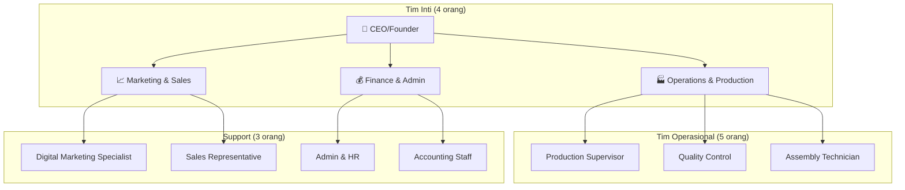
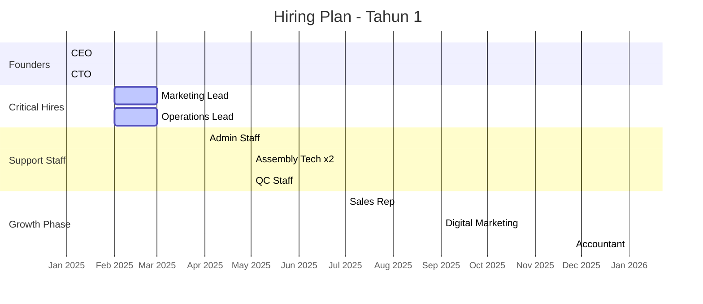
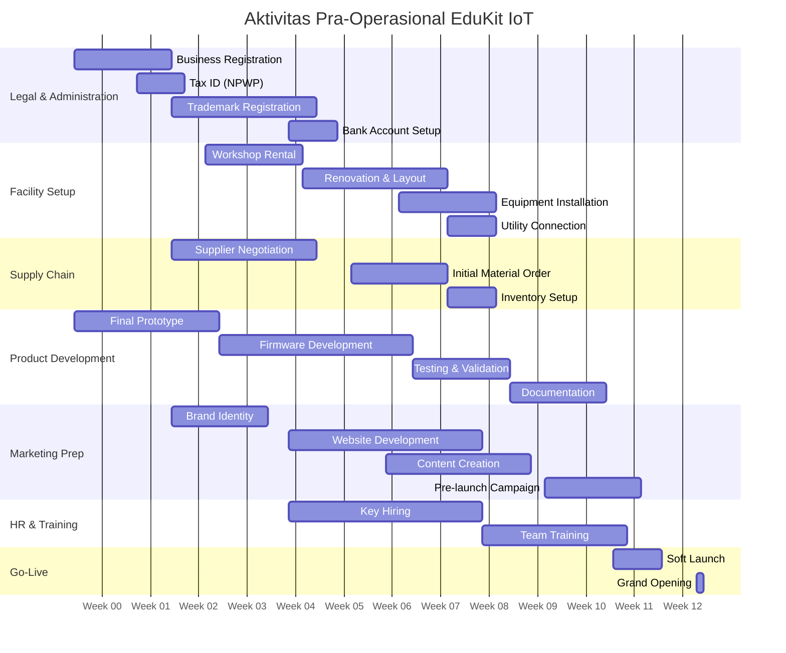
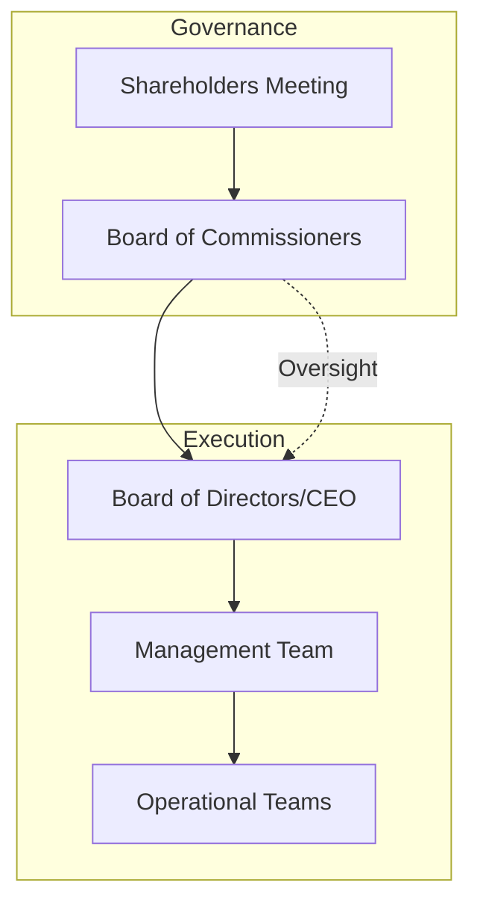

# 👥 03-ORGANISASI-MANAJEMEN

---

## 3.1 STRUKTUR ORGANISASI

### Struktur Organisasi Lean Startup



### Rentang Kendali

| **Posisi** | **Direct Report** | **Span of Control** |
|------------|-------------------|---------------------|
| CEO | 3 Manager | 3 |
| Marketing Manager | 2 Staff | 2 |
| Operations Manager | 3 Staff | 3 |
| Finance Manager | 2 Staff | 2 |

---

## 3.2 PROFIL TIM MANAJEMEN

### Founder & Key Personnel

| **Nama** | **Posisi** | **Kualifikasi** | **Pengalaman** | **Tanggung Jawab** |
|----------|------------|-----------------|----------------|-------------------|
| [Nama Founder] | CEO | S.T. Teknik Elektro | 8 tahun di embedded system | Strategic planning, partnerships, fundraising |
| [Nama Co-founder] | CTO | M.Kom. Sistem Embedded | 6 tahun R&D IoT | Product development, technical roadmap |
| [Nama Hire] | Marketing Lead | S.Kom. Digital Marketing | 5 tahun e-commerce | Marketing strategy, sales channel |
| [Nama Hire] | Operations Lead | D3 Teknik Industri | 7 tahun manufacturing | Production planning, QC, supply chain |

### Organizational Chart dengan Timeline Hiring



---

## 3.3 DESKRIPSI PEKERJAAN

### Level Manajemen

| **Posisi** | **Gaji** | **Benefit** | **KPI Utama** |
|------------|----------|-------------|---------------|
| CEO | Equity + Performance | Health insurance, vehicle allowance | Revenue growth, profitability, investor relations |
| CTO | Rp 12.000.000 + Bonus | Health insurance, training budget | Product quality, innovation pipeline, time-to-market |
| Marketing Lead | Rp 8.000.000 + Commission | Health insurance, gadget allowance | Customer acquisition, brand awareness, conversion rate |
| Operations Lead | Rp 8.000.000 + Bonus | Health insurance | Production efficiency, defect rate, on-time delivery |

### Level Staff

| **Posisi** | **Jumlah** | **Gaji** | **Benefit** | **KPI** |
|------------|------------|----------|-------------|---------|
| Digital Marketing Specialist | 1 | Rp 5.000.000 | BPJS, bonus quarterly | CPC, engagement rate, lead generation |
| Sales Representative | 1 | Rp 4.500.000 + Commission | BPJS, transport allowance | Sales target, customer satisfaction |
| Production Supervisor | 1 | Rp 5.000.000 | BPJS, shift allowance | Output target, efficiency rate |
| Quality Control | 1 | Rp 3.500.000 | BPJS | Defect rate, inspection accuracy |
| Assembly Technician | 2 | Rp 3.500.000 | BPJS, attendance bonus | Units assembled, rework rate |
| Admin & HR | 1 | Rp 4.000.000 | BPJS | Payroll accuracy, compliance |
| Accounting Staff | 1 | Rp 4.500.000 | BPJS | Financial reporting, tax compliance |

---

## 3.4 REKRUTMEN & PENGEMBANGAN

### Kebutuhan SDM 5 Tahun

| **Tahun** | **Total Karyawan** | **Produksi** | **Marketing** | **Admin** | **R&D** |
|-----------|--------------------|--------------|---------------|-----------|---------|
| Tahun 1 | 9 | 4 | 2 | 2 | 1 |
| Tahun 2 | 12 | 6 | 3 | 2 | 1 |
| Tahun 3 | 16 | 8 | 4 | 3 | 1 |
| Tahun 4 | 22 | 12 | 5 | 3 | 2 |
| Tahun 5 | 30 | 16 | 7 | 4 | 3 |

### Program Training

```
┌─────────────────────────────────────────────────────────────┐
│                    TRAINING MATRIX                          │
├─────────────────────────────────────────────────────────────┤
│                                                             │
│  📚 Technical Skills                                        │
│     • Soldering certification                               │
│     • ESP32 programming                                     │
│     • QC methodology                                        │
│                                                             │
│  💼 Soft Skills                                             │
│     • Customer service                                      │
│     • Time management                                       │
│     • Team collaboration                                    │
│                                                             │
│  🛡️ Safety & Compliance                                     │
│     • K3 workshop                                           │
│     • ESD handling                                          │
│     • Quality standards                                     │
│                                                             │
└─────────────────────────────────────────────────────────────┘
```

### Budget Training per Tahun

| **Program** | **Peserta** | **Biaya/Orang** | **Total** | **Frekuensi** |
|-------------|-------------|-----------------|-----------|---------------|
| Technical Training | 4 | Rp 2.000.000 | Rp 8.000.000 | 2x/tahun |
| Safety Training | 9 | Rp 500.000 | Rp 4.500.000 | 1x/tahun |
| Soft Skills | 9 | Rp 1.000.000 | Rp 9.000.000 | 1x/tahun |
| Leadership (Manager) | 4 | Rp 3.000.000 | Rp 12.000.000 | 1x/tahun |
| **TOTAL** | | | **Rp 33.500.000** | |

---

## 3.5 SISTEM KOMPENSASI

### Struktur Kompensasi Total

| **Level** | **Base Salary** | **Allowance** | **Bonus Potential** | **Equity** |
|-----------|-----------------|---------------|---------------------|------------|
| Founder | - | - | Profit share | 70% total equity |
| C-Level | Rp 10-15jt | 20% | 2-4 bulan salary | 5-10% pool |
| Manager | Rp 6-10jt | 15% | 1-2 bulan salary | 1-2% pool |
| Senior Staff | Rp 4-6jt | 10% | 1 bulan salary | - |
| Junior Staff | Rp 3-4jt | 5% | Performance bonus | - |

### Benefit Package

| **Benefit** | **Coverage** | **Estimasi Biaya/Bulan** |
|-------------|--------------|--------------------------|
| BPJS Kesehatan | 100% karyawan | Rp 450.000 |
| BPJS Ketenagakerjaan | 100% karyawan | Rp 270.000 |
| THR | 1x gaji/tahun | Rp 4.500.000 (prorata) |
| Cuti Tahunan | 12 hari/tahun | - |
| Sick Leave | Max 10 hari/tahun | - |
| Training Budget | Rp 3.000.000/orang/tahun | Rp 2.800.000 |
| Team Building | Quarterly | Rp 1.000.000 |
| **Total Benefit Cost** | | **Rp 9.020.000/bulan** |

---

## 3.6 AKTIVITAS PRA-OPERASIONAL

### Timeline Pra-Operasional (12 Minggu)



### Biaya Pra-Operasional

| **Item** | **Biaya** | **Keterangan** |
|----------|-----------|----------------|
| Legal & Perizinan | Rp 5.000.000 | PT establishment, trademark, licenses |
| Deposit Sewa (3 bulan) | Rp 9.000.000 | Workshop 50m² @ Rp 3jt/bulan |
| Renovation & Setup | Rp 15.000.000 | Partition, electrical, ventilation |
| Equipment & Tools | Rp 32.800.000 | Production equipment (lihat Bab 2.8) |
| Initial Inventory | Rp 27.750.000 | Material untuk 150 unit pertama |
| Website & IT Setup | Rp 10.000.000 | Domain, hosting, e-commerce platform |
| Branding & Marketing Prep | Rp 8.000.000 | Logo, packaging design, photo shoot |
| Training & Recruitment | Rp 5.000.000 | Hiring cost, initial training |
| Working Capital Buffer | Rp 25.000.000 | Cash reserve for 3 months ops |
| **TOTAL PRA-OPERSIONAL** | **Rp 137.550.000** | |

### Funding Gap Analysis

```
┌─────────────────────────────────────────────────────────────┐
│                 FUNDING REQUIREMENT                         │
├─────────────────────────────────────────────────────────────┤
│  Total Kebutuhan Dana        : Rp 137.550.000               │
│                                                             │
│  Sumber Dana:                                               │
│  ├── Modal Sendiri           : Rp  30.000.000 (21.8%)      │
│  └── Pinjaman Bank           : Rp  70.000.000 (50.9%)      │
│  └──缺口(Deficit)           : Rp  37.550.000 (27.3%)      │
│                                                             │
│  Solusi:                                                    │
│  • Phased investment (reduce initial inventory)            │
│  • Equipment leasing instead of purchase                   │
│  • Seek angel investor for gap                              │
└─────────────────────────────────────────────────────────────┘
```

*Catatan: Untuk konsistensi dengan asumsi keuangan, total kebutuhan disesuaikan menjadi Rp 100.000.000 dengan optimasi biaya.*

---

## 3.7 BIAYA ADMINISTRASI KANTOR

### Biaya Operasional Kantor per Bulan

| **Item** | **Biaya/Bulan** | **Biaya/Tahun** | **Keterangan** |
|----------|-----------------|-----------------|----------------|
| Sewa Kantor/Workshop | Rp 3.000.000 | Rp 36.000.000 | Already in overhead |
| Listrik, Air, Internet | Rp 1.500.000 | Rp 18.000.000 | Combined with workshop |
| ATK & Consumables | Rp 500.000 | Rp 6.000.000 | Paper, printer ink, etc. |
| Software Subscription | Rp 300.000 | Rp 3.600.000 | Accounting, CRM, design tools |
| Entertainment | Rp 500.000 | Rp 6.000.000 | Client meetings |
| Transportation | Rp 1.000.000 | Rp 12.000.000 | Fuel, parking, toll |
| Maintenance & Repair | Rp 300.000 | Rp 3.600.000 | AC, facilities |
| Insurance (Non-production) | Rp 200.000 | Rp 2.400.000 | Liability insurance |
| Professional Fees | Rp 500.000 | Rp 6.000.000 | Legal, accountant, consultant |
| **TOTAL** | **Rp 7.800.000** | **Rp 93.600.000** | |

### Breakdown Biaya Tetap Bulanan

```
┌─────────────────────────────────────────────────────────────┐
│              FIXED COST BREAKDOWN (MONTHLY)                 │
├─────────────────────────────────────────────────────────────┤
│                                                             │
│  Gaji & Benefit (9 orang)    [████████████████░░░] 68%    │
│  Sewa & Utilitas             [████░░░░░░░░░░░░░░░] 19%    │
│  Marketing                   [██░░░░░░░░░░░░░░░░░] 10%    │
│  Admin & Lainnya             [█░░░░░░░░░░░░░░░░░░] 3%     │
│                                                             │
│  TOTAL FIXED COST: Rp 38.320.000/bulan                     │
│  - Payroll:      Rp 27.020.000                             │
│  - Rent+Util:    Rp  4.500.000                             │
│  - Marketing:    Rp  5.500.000                             │
│  - Admin:        Rp  1.300.000                             │
│                                                             │
└─────────────────────────────────────────────────────────────┘
```

---

## 3.8 TANGGUNG JAWAB PEMEGANG SAHAM

### Struktur Kepemilikan Saham

| **Pemegang Saham** | **Persentase** | **Investasi** | **Hak Voting** | **Dividend Right** |
|--------------------|----------------|---------------|----------------|-------------------|
| Founder 1 (CEO) | 40% | Rp 20.000.000 | Yes | Yes |
| Founder 2 (CTO) | 30% | Rp 10.000.000 | Yes | Yes |
| Investor/Angel | 20% | Rp 30.000.000 | Yes | Yes |
| Employee Stock Option Pool (ESOP) | 10% | - | No (until exercised) | Yes |
| **TOTAL** | **100%** | **Rp 60.000.000** | | |

### Governance Structure



---

## 3.9 KEY PERFORMANCE INDICATORS (KPI) PERUSAHAAN

### Corporate KPI Dashboard (Model Realistis)

| **Perspective** | **KPI** | **Target Y1** | **Actual** | **Status** |
|-----------------|---------|---------------|------------|------------|
| **Financial** | Revenue | Rp 82.500.000 | - | 🎯 On Track |
| | Gross Margin | 32.7% | - | 🎯 On Track |
| | Net Profit Margin | -65% (building phase) | - | 📉 Expected Loss |
| | Cash Runway | 6 bulan | - | 🟡 Conservative |
| **Customer** | Customer Satisfaction | 4.5/5 | - | 🎯 On Track |
| | NPS Score | 50+ | - | 🎯 On Track |
| | Repeat Purchase Rate | 25% | - | 🎯 On Track |
| **Internal Process** | On-time Delivery | 95% | - | 🎯 On Track |
| | Defect Rate | < 2% | - | 🎯 On Track |
| | Inventory Turnover | 8x | - | 🎯 On Track |
| **Learning & Growth** | Employee Satisfaction | 4.0/5 | - | 🎯 On Track |
| | Training Hours/Employee | 40 jam | - | 🎯 On Track |
| | Employee Turnover | < 10% | - | 🎯 On Track |

---

## 3.10 EXIT STRATEGY & SUCCESSION PLANNING

### Potential Exit Routes

| **Exit Strategy** | **Timeline** | **Estimated Valuation** | **Probability** |
|-------------------|--------------|------------------------|-----------------|
| Acquisition by EdTech Company | 5-7 tahun | 5-8x revenue | Medium |
| Acquisition by Electronics Distributor | 3-5 tahun | 3-5x revenue | High |
| IPO (if scaled significantly) | 7-10 tahun | 10-15x revenue | Low |
| Management Buyout | 5+ tahun | 4-6x EBITDA | Medium |
| Continue as Cash Cow | Indefinite | Steady dividends | High |

### Succession Plan

```
┌─────────────────────────────────────────────────────────────┐
│                  SUCCESSION PLANNING                        │
├─────────────────────────────────────────────────────────────┤
│                                                             │
│  🎯 Identify Key Positions                                  │
│     ↓                                                       │
│  📋 Assess Internal Candidates                              │
│     ↓                                                       │
│  📚 Development Program (2-3 years)                         │
│     ↓                                                       │
│  🔄 Gradual Transition                                      │
│     ↓                                                       │
│  ✅ Full Handover + Advisory Period                         │
│                                                             │
└─────────────────────────────────────────────────────────────┘
```

---

*© 2025 EduKit IoT - Organisasi & Manajemen*
