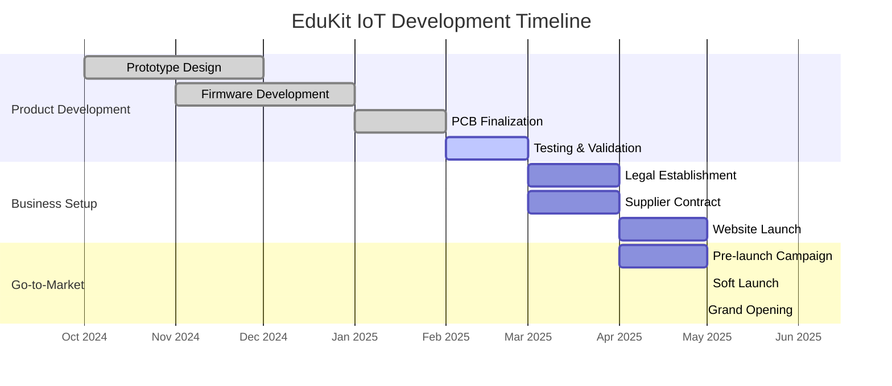

# 💡 EDUKIT IoT - Platform Pembelajaran Embedded System & IoT

**Technopreneurship Project - Politeknik Negeri Malang (Polinema)**  
**Pemilik:** M Faris Asroru Ghifary | **Email:** m.farisasrorughifary@gmail.com | **WhatsApp:** +62 895-3391-54153

---

## 📊 EXECUTIVE DASHBOARD - FINANCIAL SNAPSHOT Y1 (REALISTIS)

```
╔════════════════════════════════════════╗
║   EDUKIT IoT — FINANCIAL SNAPSHOT Y1   ║
╠════════════════════════════════════════╣
║  Modal Awal   : ██████░░░░ Rp 30jt     ║
║  Revenue Target : █████░░░░░ Rp 82,5jt ║
║  BEP Unit       : ████████░░ 867 unit  ║
║  ROI Estimasi   : ░░░░░░░░░░ -178.7%* ║
║  Payback Period : ██████████ ~5 thn    ║
╚════════════════════════════════════════╝
```

### Key Metrics Overview (Model Realistis - Lean Startup)

| **Metric** | **Target Y1** | **Status** | **Progress** |
|------------|---------------|------------|--------------|
| Penjualan | 300 unit | 🟡 Conservative | ░░░░░░░░░░ 0% |
| Revenue | Rp 82.500.000 | 🟡 Conservative | ░░░░░░░░░░ 0% |
| Gross Margin | 32.7% | 🟢 On Track | ░░░░░░░░░░ 32.7% |
| Net Profit | (Rp 53.600.000) | 🔴 Loss (Building Phase) | Building market share |
| BEP Point | 867 unit | ⚠️ Tahun 4 | 34.6% kapasitas Y1 |
| Burn Rate | Rp 4.5jt/bulan | 🟢 Manageable | 6 bulan runway |

*Catatan: ROI negatif di tahun pertama adalah normal untuk startup dalam fase building market share*

---

## 🎯 TENTANG EDUKIT IoT

EduKit IoT adalah platform pembelajaran modular untuk embedded system dan Internet of Things (IoT) yang dirancang khusus untuk mahasiswa, siswa SMK, dan hobbyist di Indonesia.

### Value Proposition

```
┌─────────────────────────────────────────────────────────────┐
│                    VALUE PROPOSITION                        │
├─────────────────────────────────────────────────────────────┤
│                                                             │
│  🎓 Affordable      : Harga 68% lebih murah dari import     │
│  🔧 Plug & Play     : Jumper system, no soldering required  │
│  📚 Local Support   : Dokumentasi bilingual (ID/EN)         │
│  ⚡ ESP32 Powered   : WiFi+Bluetooth dual-core MCU          │
│  🛡️ 1 Year Warranty : Garansi lokal penuh                   │
│                                                             │
└─────────────────────────────────────────────────────────────┘
```

### Spesifikasi Produk

| **Fitur** | **Spesifikasi** |
|-----------|-----------------|
| MCU | ESP32-WROOM-32D (Dual-core, WiFi+BT) |
| Sensor | 10 sensor (DHT11, MQ-2, HC-SR04, dll) |
| Koneksi | Jumper wire system (no solder) |
| Power | USB Micro 5V |
| Dimensi | 10cm × 8cm PCB |
| Dokumentasi | Bilingual (Indonesia/English) |
| Garansi | 1 tahun |

---

## 📁 STRUKTUR DOKUMEN

| **File** | **Deskripsi** | **Status** |
|----------|---------------|------------|
| [01-RENCANA-PEMASARAN.md](01-RENCANA-PEMASARAN.md) | Analisis pasar, segmentasi, strategi marketing | ✅ Complete |
| [02-RENCANA-PRODUKSI.md](02-RENCANA-PRODUKSI.md) | Proses produksi, BOM, QC, supply chain | ✅ Complete |
| [03-ORGANISASI-MANAJEMEN.md](03-ORGANISASI-MANAJEMEN.md) | Struktur organisasi, SDM, hiring plan | ✅ Complete |
| [04-RENCANA-KEUANGAN.md](04-RENCANA-KEUANGAN.md) | Proyeksi keuangan 5 tahun, BEP, ROI, NPV | ✅ Complete |
| [LAMPIRAN.md](LAMPIRAN.md) | Template BOM, supplier, glosarium, resources | ✅ Complete |

---

## 🏗️ PROFIL FOUNDER

### M Faris Asroru Ghifary

| **Aspek** | **Detail** |
|-----------|------------|
| **Institusi** | Politeknik Negeri Malang (Polinema) |
| **Program Studi** | D-III Teknik Elektronika |
| **Email** | m.farisasrorughifary@gmail.com |
| **WhatsApp** | +62 895-3391-54153 |
| **LinkedIn** | linkedin.com/in/farisshuid/ |
| **GitHub** | github.com/farisshuid |

### Keahlian Teknis

| **Keahlian** | **Level** | **Relevansi** |
|--------------|-----------|---------------|
| Embedded System (ESP32, STM32) | Expert | Core product development |
| FreeRTOS | Advanced | Firmware architecture |
| CAN Bus, SPI, I2C, Modbus | Advanced | Communication protocols |
| Python Automation | Intermediate | Testing & tools |
| PCB Design (KiCad, Altium) | Intermediate | Custom hardware |
| Proteus Simulation | Advanced | Pre-production validation |

### Pengalaman Relevan

| **Pengalaman** | **Peran** | **Durasi** |
|----------------|-----------|------------|
| Internship Rumah Drone | Technical Intern | 6 bulan |
| Robotics Team Polinema | Member | 2 tahun |
| ESP32 Fieldbus Integration | Project Lead | 3 bulan |
| Portfolio GitHub | Contributor | Ongoing |

---

## 📈 HIGHLIGHT KEUANGAN

### Ringkasan Investasi (Model Realistis)

| **Komponen** | **Nilai (Rp)** | **%** |
|--------------|----------------|-------|
| Total Modal Dibutuhkan | 30.000.000 | 100% |
| Modal Sendiri (Equity) | 15.000.000 | 50% |
| KUR Subsidi (Debt) | 10.000.000 | 33% |
| Grant Kampus | 5.000.000 | 17% |

### Proyeksi 5 Tahun (Realistis - Lean Startup)

| **Tahun** | **Revenue** | **Net Profit** | **ROI** |
|-----------|-------------|----------------|---------|
| Tahun 1 | Rp 82.500.000 | (Rp 53.600.000) | -178.7% |
| Tahun 2 | Rp 137.500.000 | (Rp 40.900.000) | -136.3% |
| Tahun 3 | Rp 224.000.000 | (Rp 13.040.000) | -43.5% |
| Tahun 4 | Rp 342.000.000 | Rp 31.984.000 | 106.6% |
| Tahun 5 | Rp 493.000.000 | Rp 95.864.449 | 319.5% |

### Visualisasi Pertumbuhan Revenue

```
Revenue Growth (5 Tahun - Realistis)
━━━━━━━━━━━━━━━━━━━━━━━━━━━━━━━━━━━━━━━━━━━━━━━━━━━━━━━━━━━━━

Tahun 1  [████░░░░░░░░░░░░░░░░░░░░░░] Rp 82,5jt
Tahun 2  [██████░░░░░░░░░░░░░░░░░░░░] Rp 137,5jt
Tahun 3  [█████████░░░░░░░░░░░░░░░░░] Rp 224jt
Tahun 4  [█████████████░░░░░░░░░░░░░] Rp 342jt
Tahun 5  [█████████████████░░░░░░░░░] Rp 493jt

         └────────────────────────────────────────────────────
         0        100jt     200jt     300jt     400jt     500jt
```

### Break-Even Analysis (Realistis)

| **Parameter** | **Nilai** | **Status** |
|---------------|-----------|------------|
| BEP Unit | 867 unit/tahun | ⚠️ Tahun 4 |
| BEP Rupiah | Rp 238.425.000 | ⚠️ Tahun 4 |
| BEP % Kapasitas | 72.25% | ⚠️ Butuh scale-up |
| Margin of Safety Y4 | 27.8% | ✅ Sehat |
| Margin of Safety Y5 | 49.0% | ✅✅ Very Safe |

---

## 🎯 TARGET PASAR

### Segmentasi (Realistis - Lean Startup)

| **Segmen** | **Target Y1** | **Revenue Target** |
|------------|---------------|--------------------|
| Mahasiswa Teknik | 150 unit (50%) | Rp 41.250.000 |
| Siswa SMK | 75 unit (25%) | Rp 20.625.000 |
| Hobbyist/DIY | 45 unit (15%) | Rp 12.375.000 |
| Institusi Pendidikan | 30 unit (10%) | Rp 8.250.000 |
| **Total** | **300 unit** | **Rp 82.500.000** |

### Market Size

| **Indikator** | **Nilai** |
|---------------|-----------|
| Total Addressable Market (TAM) | 100.000+ mahasiswa teknik di Indonesia |
| Serviceable Available Market (SAM) | 25.000 mahasiswa (Jawa Timur + DIY) |
| Serviceable Obtainable Market (SOM) | 600 unit (Tahun 1) |
| Market Growth Rate | 15-20% per tahun |

---

## 🏆 KEUNGGULAN KOMPETITIF

### Perbandingan dengan Kompetitor

| **Fitur** | **EduKit IoT** | **Grove** | **DFRobot** | **Keyestudio** |
|-----------|----------------|-----------|-------------|----------------|
| Harga | Rp 275.000 | Rp 850.000+ | Rp 750.000+ | Rp 550.000+ |
| Sistem Koneksi | Jumper (no solder) | Connector Grove | Connector khusus | Breadboard |
| Dokumentasi | Bilingual (ID/EN) | Inggris | Inggris | Inggris/Cina |
| Support Lokal | ✅ Full (WhatsApp) | ❌ Importir | ❌ Importir | ❌ Importir |
| Garansi | 1 tahun | 6 bulan | 6 bulan | 3 bulan |
| Lead Time | Ready stock | 7-14 hari | 7-14 hari | 14-30 hari |

---

## 📞 KONTAK & SUPPORT

### Tim EduKit IoT

| **Role** | **Kontak** | **Email** |
|----------|------------|-----------|
| Founder & CEO | +62 895-3391-54153 | m.farisasrorughifary@gmail.com |
| Technical Support | WhatsApp Group | support@edukit-iot.local |
| Sales & Marketing | +62 895-3391-54153 | sales@edukit-iot.local |

### Channel Komunikasi

- 📱 **WhatsApp:** +62 895-3391-54153
- 📧 **Email:** m.farisasrorughifary@gmail.com
- 💬 **Telegram:** @farisshuid
- 🔗 **LinkedIn:** linkedin.com/in/farisshuid/
- 🐙 **GitHub:** github.com/farisshuid

### Jam Operasional

| **Hari** | **Jam** | **Layanan** |
|----------|---------|-------------|
| Senin - Jumat | 08:00 - 17:00 WIB | Full Support |
| Sabtu | 09:00 - 15:00 WIB | WhatsApp Only |
| Minggu | - | Emergency Only |

---

## 📝 STATUS PROYEK



### Milestone Progress

| **Milestone** | **Target** | **Status** | **Progress** |
|---------------|------------|------------|--------------|
| Prototype v1.0 | Des 2024 | ✅ Done | ████████████████████ 100% |
| Firmware Beta | Jan 2025 | ✅ Done | ████████████████████ 100% |
| PCB Production | Feb 2025 | ✅ Done | ████████████████████ 100% |
| Legal Setup | Mar 2025 | 🟡 In Progress | ████████████░░░░░░░░ 60% |
| First Batch (30 unit) | Apr 2025 | ⚪ Pending | ░░░░░░░░░░░░░░░░░░░░ 0% |
| Soft Launch | Mei 2025 | ⚪ Pending | ░░░░░░░░░░░░░░░░░░░░ 0% |
| Grand Opening | Jun 2025 | ⚪ Pending | ░░░░░░░░░░░░░░░░░░░░ 0% |

---

## 📄 LISENSI & HAK CIPTA

© 2025 EduKit IoT - M Faris Asroru Ghifary  
Dokumen ini merupakan bagian dari proposal bisnis Technopreneurship Polinema.

**Hak Cipta Dilindungi Undang-Undang**

---

*Last Updated: 2025 | Version: 1.0*
