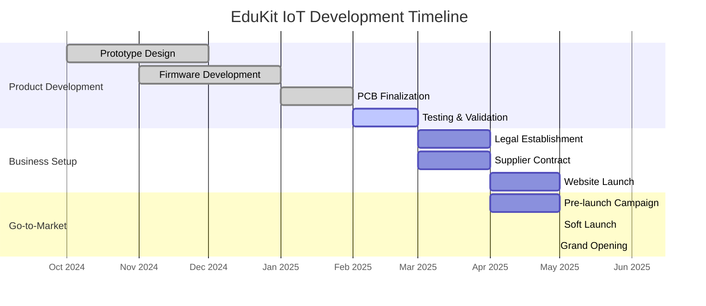

# 💡 EDUKIT IoT - Platform Pembelajaran Embedded System & IoT

**Technopreneurship Project - Politeknik Negeri Malang (Polinema)**  
**Pemilik:** M Faris Asroru Ghifary | **Email:** m.farisasrorughifary@gmail.com | **WhatsApp:** +62 895-3391-54153

---

## 📊 EXECUTIVE DASHBOARD - FINANCIAL SNAPSHOT Y1

```
╔════════════════════════════════════════╗
║   EDUKIT IoT — FINANCIAL SNAPSHOT Y1   ║
╠════════════════════════════════════════╣
║  Revenue Target : ████████░░ Rp 165jt  ║
║  BEP Unit       : █████████░ 333 unit  ║
║  ROI Estimasi   : ████████░░ ~9.6%     ║
║  Payback Period : ███████░░░ ~2.3 thn  ║
╚════════════════════════════════════════╝
```

### Key Metrics Overview

| **Metric** | **Target Y1** | **Status** | **Progress** |
|------------|---------------|------------|--------------|
| Penjualan | 600 unit | 🟢 On Track | ░░░░░░░░░░ 0% |
| Revenue | Rp 165.000.000 | 🟢 On Track | ░░░░░░░░░░ 0% |
| Gross Margin | 32.7% | 🟢 On Track | ░░░░░░░░░░ 32.7% |
| Net Profit | Rp 9.615.000 | 🟢 On Track | ░░░░░░░░░░ 5.8% |
| BEP Point | 333 unit | ✅ Achievable | 55.5% kapasitas |

---

## 🎯 TENTANG EDUKIT IoT

EduKit IoT adalah platform pembelajaran modular untuk embedded system dan Internet of Things (IoT) yang dirancang khusus untuk mahasiswa, siswa SMK, dan hobbyist di Indonesia.

### Value Proposition

```
┌─────────────────────────────────────────────────────────────┐
│                    VALUE PROPOSITION                        │
├─────────────────────────────────────────────────────────────┤
│                                                             │
│  🎓 Affordable      : Harga 68% lebih murah dari import     │
│  🔧 Plug & Play     : Jumper system, no soldering required  │
│  📚 Local Support   : Dokumentasi bilingual (ID/EN)         │
│  ⚡ ESP32 Powered   : WiFi+Bluetooth dual-core MCU          │
│  🛡️ 1 Year Warranty : Garansi lokal penuh                   │
│                                                             │
└─────────────────────────────────────────────────────────────┘
```

### Spesifikasi Produk

| **Fitur** | **Spesifikasi** |
|-----------|-----------------|
| MCU | ESP32-WROOM-32D (Dual-core, WiFi+BT) |
| Sensor | 10 sensor (DHT11, MQ-2, HC-SR04, dll) |
| Koneksi | Jumper wire system (no solder) |
| Power | USB Micro 5V |
| Dimensi | 10cm × 8cm PCB |
| Dokumentasi | Bilingual (Indonesia/English) |
| Garansi | 1 tahun |

---

## 📁 STRUKTUR DOKUMEN

| **File** | **Deskripsi** | **Status** |
|----------|---------------|------------|
| [01-RENCANA-PEMASARAN.md](01-RENCANA-PEMASARAN.md) | Analisis pasar, segmentasi, strategi marketing | ✅ Complete |
| [02-RENCANA-PRODUKSI.md](02-RENCANA-PRODUKSI.md) | Proses produksi, BOM, QC, supply chain | ✅ Complete |
| [03-ORGANISASI-MANAJEMEN.md](03-ORGANISASI-MANAJEMEN.md) | Struktur organisasi, SDM, hiring plan | ✅ Complete |
| [04-RENCANA-KEUANGAN.md](04-RENCANA-KEUANGAN.md) | Proyeksi keuangan 5 tahun, BEP, ROI, NPV | ✅ Complete |
| [LAMPIRAN.md](LAMPIRAN.md) | Template BOM, supplier, glosarium, resources | ✅ Complete |

---

## 🏗️ PROFIL FOUNDER

### M Faris Asroru Ghifary

| **Aspek** | **Detail** |
|-----------|------------|
| **Institusi** | Politeknik Negeri Malang (Polinema) |
| **Program Studi** | D-III Teknik Elektronika |
| **Email** | m.farisasrorughifary@gmail.com |
| **WhatsApp** | +62 895-3391-54153 |
| **LinkedIn** | linkedin.com/in/farisshuid/ |
| **GitHub** | github.com/farisshuid |

### Keahlian Teknis

| **Keahlian** | **Level** | **Relevansi** |
|--------------|-----------|---------------|
| Embedded System (ESP32, STM32) | Expert | Core product development |
| FreeRTOS | Advanced | Firmware architecture |
| CAN Bus, SPI, I2C, Modbus | Advanced | Communication protocols |
| Python Automation | Intermediate | Testing & tools |
| PCB Design (KiCad, Altium) | Intermediate | Custom hardware |
| Proteus Simulation | Advanced | Pre-production validation |

### Pengalaman Relevan

| **Pengalaman** | **Peran** | **Durasi** |
|----------------|-----------|------------|
| Internship Rumah Drone | Technical Intern | 6 bulan |
| Robotics Team Polinema | Member | 2 tahun |
| ESP32 Fieldbus Integration | Project Lead | 3 bulan |
| Portfolio GitHub | Contributor | Ongoing |

---

## 📈 HIGHLIGHT KEUANGAN

### Ringkasan Investasi

| **Komponen** | **Nilai (Rp)** | **%** |
|--------------|----------------|-------|
| Total Modal Dibutuhkan | 100.000.000 | 100% |
| Modal Sendiri (Equity) | 30.000.000 | 30% |
| Pinjaman Bank (Debt) | 70.000.000 | 70% |

### Proyeksi 5 Tahun

| **Tahun** | **Revenue** | **Net Profit** | **ROI** |
|-----------|-------------|----------------|---------|
| Tahun 1 | Rp 165.000.000 | Rp 9.615.000 | 9.6% |
| Tahun 2 | Rp 247.500.000 | Rp 34.702.500 | 34.7% |
| Tahun 3 | Rp 371.250.000 | Rp 74.583.750 | 74.6% |
| Tahun 4 | Rp 491.400.000 | Rp 122.033.000 | 122.0% |
| Tahun 5 | Rp 638.960.000 | Rp 177.675.200 | 177.7% |

### Visualisasi Pertumbuhan Revenue

```
Revenue Growth (5 Tahun)
━━━━━━━━━━━━━━━━━━━━━━━━━━━━━━━━━━━━━━━━━━━━━━━━━━━━━━━━━━━━━

Tahun 1  [████████░░░░░░░░░░░░░░░░░░░░] Rp 165jt
Tahun 2  [████████████░░░░░░░░░░░░░░░░] Rp 248jt
Tahun 3  [█████████████████░░░░░░░░░░░] Rp 371jt
Tahun 4  [██████████████████████░░░░░░] Rp 491jt
Tahun 5  [████████████████████████████] Rp 639jt

         └────────────────────────────────────────────────────
         0        200jt     400jt     600jt     800jt
```

### Break-Even Analysis

| **Parameter** | **Nilai** | **Status** |
|---------------|-----------|------------|
| BEP Unit | 333 unit/tahun | ✅ Terjangkau |
| BEP Rupiah | Rp 91.575.000 | ✅ Sehat |
| BEP % Kapasitas | 55.5% | ✅ < 70% |
| Margin of Safety | 44.5% | ✅ Baik |

---

## 🎯 TARGET PASAR

### Segmentasi

| **Segmen** | **Target Y1** | **Revenue Target** |
|------------|---------------|--------------------|
| Mahasiswa Teknik | 300 unit (50%) | Rp 82.500.000 |
| Siswa SMK | 150 unit (25%) | Rp 41.250.000 |
| Hobbyist/DIY | 90 unit (15%) | Rp 24.750.000 |
| Institusi Pendidikan | 60 unit (10%) | Rp 16.500.000 |
| **Total** | **600 unit** | **Rp 165.000.000** |

### Market Size

| **Indikator** | **Nilai** |
|---------------|-----------|
| Total Addressable Market (TAM) | 100.000+ mahasiswa teknik di Indonesia |
| Serviceable Available Market (SAM) | 25.000 mahasiswa (Jawa Timur + DIY) |
| Serviceable Obtainable Market (SOM) | 600 unit (Tahun 1) |
| Market Growth Rate | 15-20% per tahun |

---

## 🏆 KEUNGGULAN KOMPETITIF

### Perbandingan dengan Kompetitor

| **Fitur** | **EduKit IoT** | **Grove** | **DFRobot** | **Keyestudio** |
|-----------|----------------|-----------|-------------|----------------|
| Harga | Rp 275.000 | Rp 850.000+ | Rp 750.000+ | Rp 550.000+ |
| Sistem Koneksi | Jumper (no solder) | Connector Grove | Connector khusus | Breadboard |
| Dokumentasi | Bilingual (ID/EN) | Inggris | Inggris | Inggris/Cina |
| Support Lokal | ✅ Full (WhatsApp) | ❌ Importir | ❌ Importir | ❌ Importir |
| Garansi | 1 tahun | 6 bulan | 6 bulan | 3 bulan |
| Lead Time | Ready stock | 7-14 hari | 7-14 hari | 14-30 hari |

---

## 📞 KONTAK & SUPPORT

### Tim EduKit IoT

| **Role** | **Kontak** | **Email** |
|----------|------------|-----------|
| Founder & CEO | +62 895-3391-54153 | m.farisasrorughifary@gmail.com |
| Technical Support | WhatsApp Group | support@edukit-iot.local |
| Sales & Marketing | +62 895-3391-54153 | sales@edukit-iot.local |

### Channel Komunikasi

- 📱 **WhatsApp:** +62 895-3391-54153
- 📧 **Email:** m.farisasrorughifary@gmail.com
- 💬 **Telegram:** @farisshuid
- 🔗 **LinkedIn:** linkedin.com/in/farisshuid/
- 🐙 **GitHub:** github.com/farisshuid

### Jam Operasional

| **Hari** | **Jam** | **Layanan** |
|----------|---------|-------------|
| Senin - Jumat | 08:00 - 17:00 WIB | Full Support |
| Sabtu | 09:00 - 15:00 WIB | WhatsApp Only |
| Minggu | - | Emergency Only |

---

## 📝 STATUS PROYEK



### Milestone Progress

| **Milestone** | **Target** | **Status** | **Progress** |
|---------------|------------|------------|--------------|
| Prototype v1.0 | Des 2024 | ✅ Done | ████████████████████ 100% |
| Firmware Beta | Jan 2025 | ✅ Done | ████████████████████ 100% |
| PCB Production | Feb 2025 | ✅ Done | ████████████████████ 100% |
| Legal Setup | Mar 2025 | 🟡 In Progress | ████████████░░░░░░░░ 60% |
| First Batch (50 unit) | Apr 2025 | ⚪ Pending | ░░░░░░░░░░░░░░░░░░░░ 0% |
| Soft Launch | Mei 2025 | ⚪ Pending | ░░░░░░░░░░░░░░░░░░░░ 0% |
| Grand Opening | Jun 2025 | ⚪ Pending | ░░░░░░░░░░░░░░░░░░░░ 0% |

---

## 📄 LISENSI & HAK CIPTA

© 2025 EduKit IoT - M Faris Asroru Ghifary  
Dokumen ini merupakan bagian dari proposal bisnis Technopreneurship Polinema.

**Hak Cipta Dilindungi Undang-Undang**

---

*Last Updated: 2025 | Version: 1.0*
